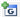
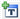
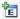
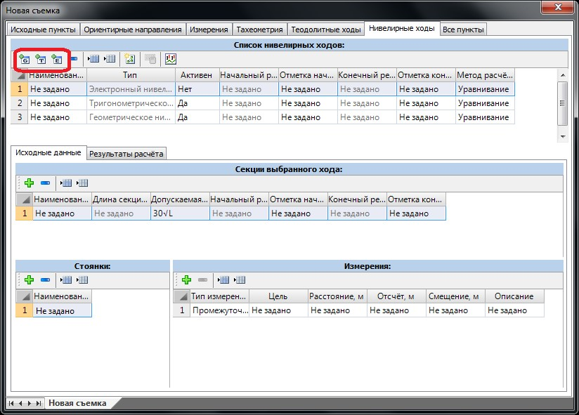

# Нивелирные ходы

На данной вкладке геодезического редактора создаются и рассчитываются нивелирные ходы следующих типов:

* [Геометрический нивелирный ход](calculation_geometric_leveling.md). Данные измерений вводятся непосредственно из журнала съемки.
* [Электронный нивелирный ход](calculation_electronic_leveling.md). Данные измерений считываются из файла съемки (тип файла – sdr) или заполняются вручную на основании произведенных измерений.
* [Тригонометрическое нивелирование](calculation_trigonometric_leveling.md). Расчет и уравнивание превышений производится на основе данных линейно-угловых измерений.

В таблице **Список нивелирных ходов** представлен набор соответствующих элементов. Каждый нивелирный ход, в свою очередь, независимо от типа должен иметь набор последовательных высотных измерений, подлежащих уравниванию.

Для создания нивелирного хода заданного типа в данной таблице необходимо нажать одну из следующих кнопок:

- Создание хода геометрического нивелирования.

- Создание хода тригонометрического нивелирования.

- Создание хода электронного нивелирования.

Также независимо от типа нивелирного хода в данной таблице ему должны быть назначены следующие параметры:

* **Наименование** - название нивелирного хода.
* **Активен** - при добавлении новых нивелирных ходов они по умолчанию являются активными. Если же необходимо исключить один или несколько ходов из расчета, то в колонке **Активность** им необходимо назначить признак **НЕТ**.
* **Начальный репер, Конечный репер** - в данных полях задаются наименование начального и конечного репера нивелирного хода. Эти поля являются информационными и недоступны для редактирования. По умолчанию начальным репером принимается первый пункт списка таблицы **Измерения**, а конечным - последний пункт списка.
* **Отметка начального репера, Отметка конечного репера** – в данных полях задаются соответствующие отметки реперов нивелирного хода. Если точки с указанными наименованием имеются в общей базе пунктов ПВО, то данные поля будут заполнены автоматически. В противном случае помимо наименования реперных точек в данных полях необходимо задать их отметки.

В зависимости от типа нивелирного хода ему задаются соответствующая группа измерений, необходимая для расчета. Данная последовательность действий рассмотрена ниже.
