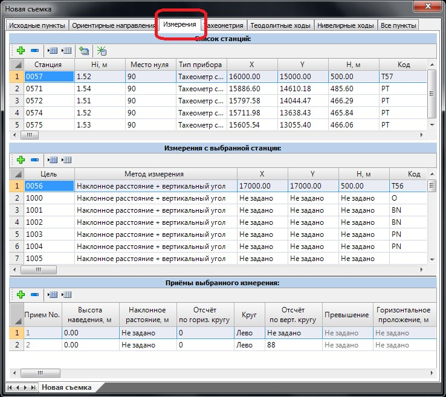
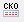
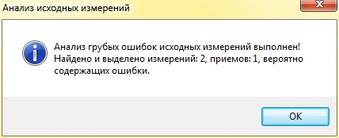
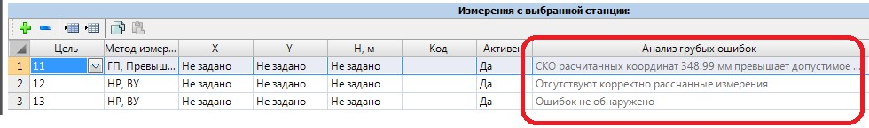
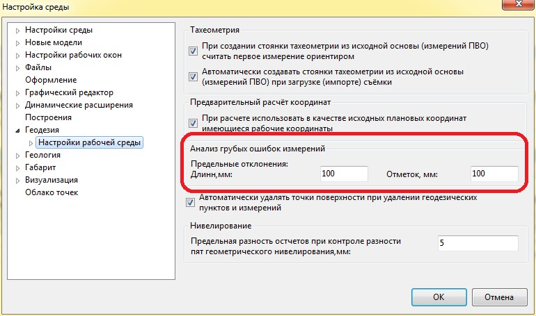

# Измерения

В таблице **Измерения** представлен полный набор измерений, загруженных из файла съемки:

При выборе одной из станций в таблице **Список станций** все точки, которые были с нее сняты, автоматически отобразятся в таблице **Измерения** выбранной станции. Если же выбрать одну из съемочных точек, то данные ее измерений отобразятся в таблице **Приемы выбранного направления**.

В таблице **Список станций** в соответствующих колонках задаются следующие параметры:

* **Станция** – наименование пункта стояния, с которого производились измерения.
* **Hi** – высота инструмента прибора.
* **МО** – место нуля прибора. Если в качестве начального направления при измерениях используются зенитные направления, то значения **МО** вводятся близкими к 90 градусам.
* **Тип прибора** – по умолчанию в данной колонке установлен параметр **Тахеометр со светодальномером**. Изменение типа прибора влияет на способ расчета дальномерных расстояний, т.к. для тахеометров и теодолитов они различны.
* **X, Y, H, Код** – Координаты, отметки и семантический код станции.

В таблице **Измерения с выбранной станции** в соответствующих колонках задаются следующие параметры съемочных точек:

**Цель** – наименование точки, которая была снята с текущей станции.

**Метод измерения** – здесь необходимо выбрать один из способов, которым производились отсчеты на съемочные точки. Возможны следующие варианты:

* Наклонное расстояние + Вертикальный угол.
* Горизонтальное проложение + Превышение.
* Наклонное расстояние + Превышение.

В зависимости от выбранного способа измерения в таблице **Приемы выбранного измерения** для ввода станут доступны соответствующие столбцы. Эти же данные будут учитываться при расчете координат съемочных точек.

**X, Y, H, Код** – координаты, отметки и семантичеческий код съемочных точек. Если расчет координат и отметок точек не производился, то в соответствующих столбцах будет запись Не задано.

В таблице «**Приемы для выбранного измерения**» в соответствующих колонках задаются все замеры, выполненные на эту съемочную точку:

* **Прием №** - если при съемке на точку производилось несколько отчетов и их необходимо усреднить, в данной колонке указывается номер приема.
* **Высота наведения** – высота наведения на цель (высота отражателя).
* **Наклонное расстояние** – измеренная наклонная дальность до цели.
* **Отчет по горизонтальному кругу** – измеренное значение отсчета по лимбу горизонтального круга. Правые по ходу углы вводятся с положительным знаком, а левые - с отрицательным.
* **Круг** - в зависимости от положения вертикального круга выбирается параметр **Лево** или **Право**.
* **Отсчет по вертикальному кругу, Превышение, Горизонтальное проложение** – в данных столбцах задаются соответствующие значения измерений. В зависимости от выбранного метода измерения один из вышеуказанных столбцов будет недоступен для ввода или редактирования.

На основании измерений данной вкладки можно выполнить предварительный расчет координат. Чтобы выполнить предварительный расчет, нажмите кнопку **Предварительный расчет**.

В результате программа рассчитает координаты съемочных точек и отобразит их в окне **План**.

С помощью кнопки , расположенной на панели окна, можно проанализировать измерения на наличие грубых ошибок.

После выбора данной опции программа анализирует измерения и выводит отчет о наличии или отсутствии ошибок:

Для **Измерений** и **Приемов** в соответствующем столбце будет отображаться подробная информация об ошибке:

Значения предельных отклонений задаются в **Настройках** (меню **Сервис**), в группе настроек **Геодезии**:



 Вся геодезическая основа хранится в единой сети измерений. Поэтому все геодезические пункты (стояки теодолитного хода, тахеометрии и т.п.) связаны межу собой. К примеру, расчет координат точек на вкладке **Измерения** приводит к автоматическому обновлению их координат и статусов на вкладке **Все пункты**.


