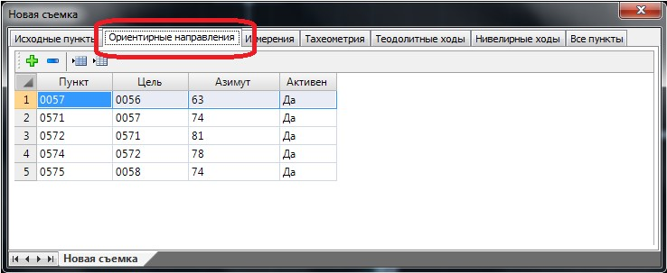

# Ориентирные направления

В таблице **Ориентирные направления** представлен перечень направлений с одного пункта на другой, которые могут быть использованы по умолчанию в качестве исходных данных (дирекционных углов) для дальнейших расчетов (полигонометрия, тахеометрия и т.п.):

Аналогично всем остальным таблицам геодезического редактора данные текущей таблицы могут быть загружены непосредственно из съемочного файла или введены/отредактированы вручную.
