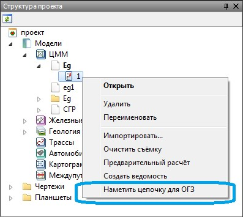
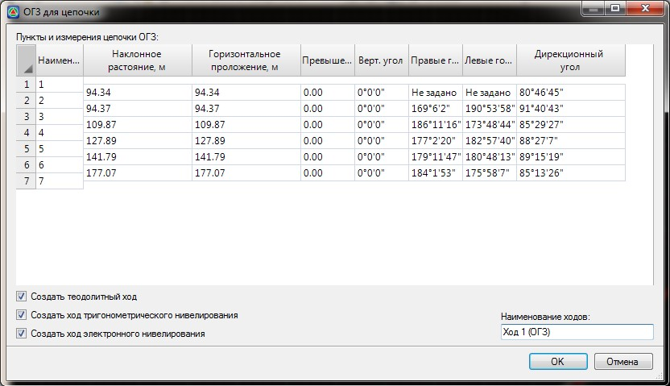

# Обратная геодезическая задача (ОГЗ)

Функция позволяет произвести расчет обратной геодезической задачи, т.е. по указанным точкам с известными координатами найти расстояния и углы. При этом по необходимости создаются теодолитный ход, ход тригонометрического и электронного нивелирования.

Для этого:

1. В **Структуре проекта** нажмите правой кнопкой мыши на элемент **Съемка**, в контекстном меню выберите **Наметить цепочку** для **ОГЗ**:

   

2. Укажите визуально или с привязкой точки, по которым будет произведен расчет **ОГЗ**. Завершите операцию клавишей **Enter** или нажмите правую кнопку мыши и выберите **Ввод**, - откроется окно:

   

3. В данном диалоговом окне имеется возможность скорректировать необходимые данные, выбрать, какие типы геодезических измерений должны быть сформированы, и задать им наименования. Нажмите **Ок**.
4. В результате в соответствующих вкладках выбранной съемки будут созданы теодолитные и нивелирные ходы.
