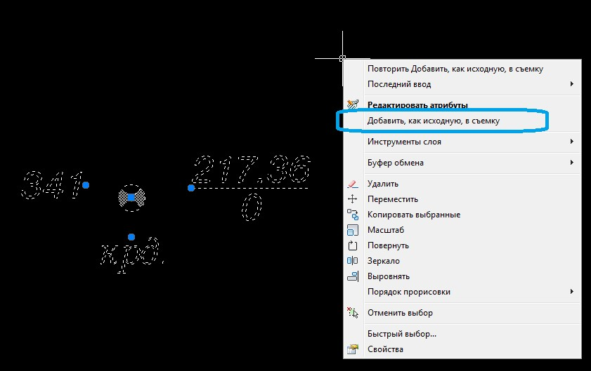
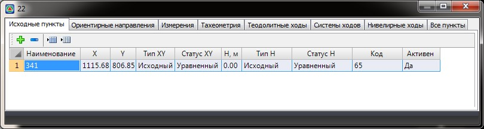

# Исходные пункты

В таблице **Исходные пункты** представлена выборка из всех точек съемки, находящихся в таблице **Все пункты**, координаты или отметки которых имеют тип **Исходный** и не подлежат пересчету. Точки с другим типом координат и отметок в этой таблице не отображаются.



 Данные в таблицах **Все пункты** и **Исходные пункты** взаимосвязаны друг с другом. К примеру, изменение значений координат или их типа в одной из таблиц приводит к автоматическому обновлению данных в другой. Это же относится и к другим вкладкам таблиц редактора, так как вся геодезическая основа хранится в единой взаимосвязанной сети измерений.



Если данные в таблице **Исходные пункты** отсутствуют либо имеют условные координаты, но при этом имеется файл (например, в формате txt) координат исходных пунктов, для заполнения данной вкладки следует выполнить следующие действия:

1. Импортируйте имеющийся файл, содержащий координаты исходных пунктов.

   

   Импорт различных форматов файлов описан в документации [Импорт/экспорт данных для построения ЦММ](../../rb_survey/dtm/sfc/exchange/dxf.md).

   

2. Выделите точку/точки поверхности, которые являются исходными пунктами. После нажатия правой кнопки мыши в открывшемся контекстном меню выберите пункт меню **Добавить, как исходную, в съемку**:

   

   

   При наличии нескольких съемок в одной **ЦММ** появится диалоговое окно, в котором необходимо выбрать съемку в соответствующей таблице, в которую будут добавлены выбранные точки.

   

3. В результате программа добавит выбранные точки в таблицу **Исходных пунктов**:

   
