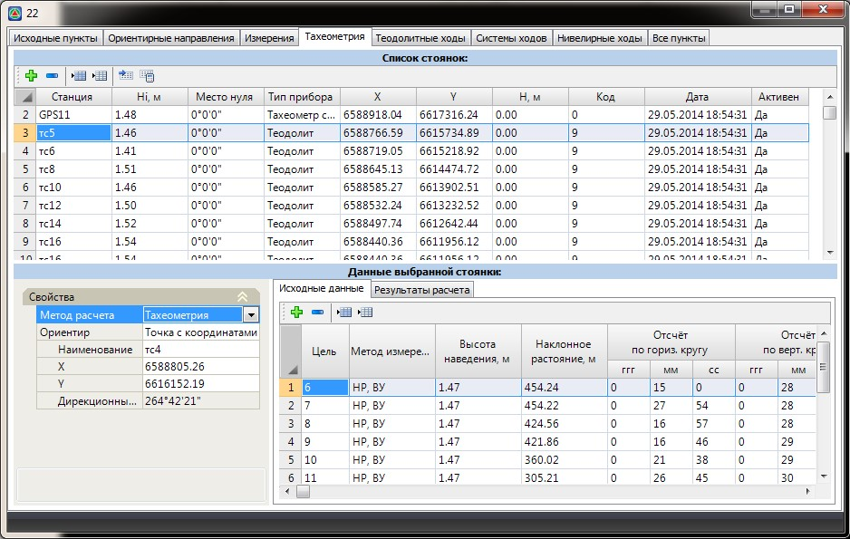
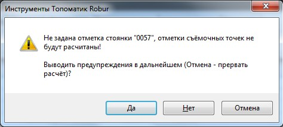

# Тахеометрия

В таблице **Тахеометрия** в специализированном виде представлены стоянки тахеометрической съемки и выполненные с них измерения.

В отличие от данных, хранящихся в таблице **Измерения**, точки тахеометрии обязательно должны иметь жесткие связи, т.е. для каждой тахеометрической станции должна быть задана точка - ориентир или ориентирное направление. По большей же части структура таблицы **Тахеометрия** идентична таблице **Измерения**, которая была описана выше.

При выборе какой-либо тахеометрической станции в таблице список стоянок группа снятых с нее точек отображается в таблице **Данные выбранной стоянки**. В отличие от вкладки измерений, где каждое измерение могло быть выполнено в несколько приемов, тахеометрическое измерение должно содержать один выбранный или усредненный прием.

Ориентирное направление текущей станции задается в группе полей свойства:

В поле **Ориентир** можно выбрать один из следующих вариантов:

* **Не задано**. Данный параметр устанавливается по умолчанию для станций, где с помощью настроек или при загрузке данных с прибора не был задан иной автоматический механизм задания ориентиров стоянкам тахеометрии.
* **Точка с координатами**. В этом случае начальный отчет задается направлением на точку с заданными координатами. Если эта точка - ориентир, уже имеющийся в базе пунктов ПВО, то необходимо лишь ввести ее наименование в соответствующем поле, а поля **X,Y** и **Дирекционный угол** будут заполнены автоматически. Если же эта точка отсутствует в таблице **Все пункты**, тогда дополнительно необходимо задать ее координаты, после чего она будет добавлена в общую базу пунктов ПВО и определит начальное направление для текущей станции.
* **Ориентирное направление**. Начальный отсчет задается направлением из исходной точки на точку-ориентир, наименование которых необходимо задать в поле **Ориентирное направление**. В качестве ориентирного направления можно использовать и обратное измерение – дирекционный угол с точки ориентира на точку стоянки. При задании ориентирного направления в соответствующем поле используется следующий формат записи: **A\_B**, где **А** и **В** – наименование исходной точки и ориентира. **A\_** - необходимый символ-разделитель между наименованиями точек.

После задания ориентирного направления поле **Дирекционный угол** будет автоматически заполнено.

Чтобы выполнить расчет координат точек тахеометрической съемки:

1. В таблице **Список станций** выберите одну или несколько станций. Для выбора всех станций, имеющихся в списке, нажмите кнопку **Выделить все строки**.
2. Чтобы рассчитать координаты точек, снятых с выделенных станций, нажмите кнопку  **Рассчитать выделенные стоянки**. Следует иметь в виду, что если рассчитанные точки одной стоянки будут являться исходными (ориентирными) для расчета другой стоянки, то расчет тахеометрических стоянок нужно вести в соответствующем порядке. Если же стоянки расположены в требуемом порядке, то достаточно просто выделить все стоянки и нажать кнопку **Расчет**.

   

   Программа выдаст предупреждение, если какие-то параметры станций, необходимые для расчета, не были заданы или были заданы некорректно:

   

   В этом случае рекомендуется прервать расчёт, нажав кнопку **Отмена**, и устранить указанные нарушения.

   

В результате программа рассчитает координаты точек тахеометрической съемки, автоматически откроет таблицу **Результаты расчета** и отобразит их в окне **План**.
