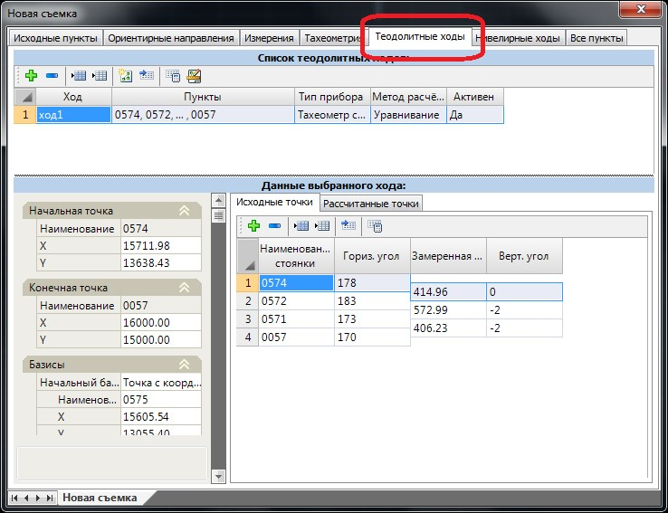
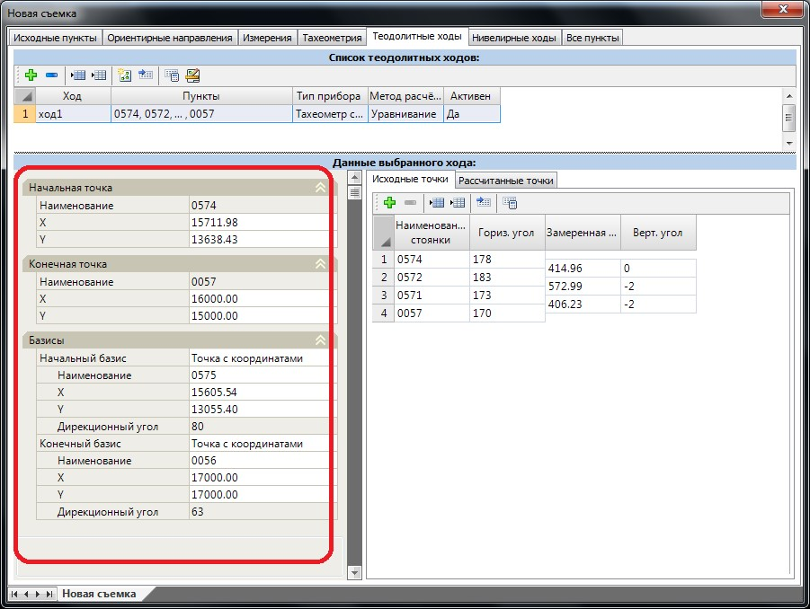
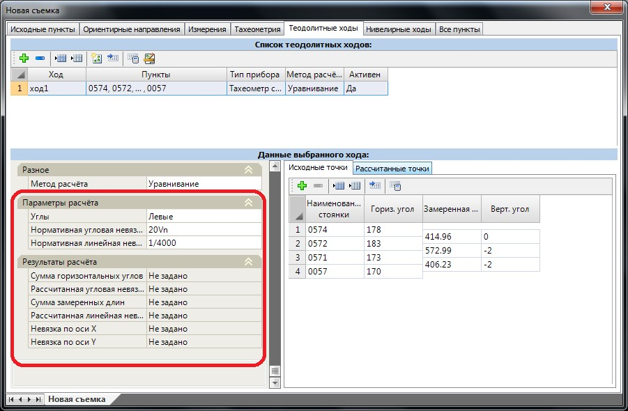
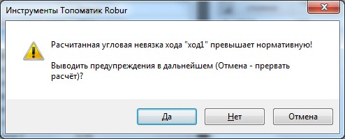

# Теодолитные ходы

На данной вкладке геодезического редактора производится создание и расчет теодолитных ходов. В таблице **Список теодолитных ходов** представлена группа соответствующих элементов. Каждый теодолитный ход, в свою очередь, должен иметь набор последовательных линейно-угловых измерений, при необходимости подлежащих уравниванию, - они задаются на вкладке **Данные выбранного хода**:

Для создания нового теодолитного хода на панели таблицы **Список теодолитных ходов** нажмите кнопку **Добавить строку**. В этой же таблице, в соответствующих колонках задаются основные параметры ходов. К ним относятся:

* **Ход** - наименование теодолитного хода.
* **Пункты** – данное поле является информационным. Для визуального контроля в нем показаны первый, последний и несколько промежуточных пунктов хода. Пункты задаются в таблице **Данные выбранного хода**.
* **Тип прибора** – в данной колонке по умолчанию установлен параметр **Тахеометр со светодальномером**. Изменение типа прибора влияет на способ расчета дальномерных расстояний, т.к. для тахеометров и теодолитов они различны.
* **Метод расчета** – для вновь создаваемых теодолитных ходов в данной колонке по умолчанию установлен признак **Уравнивание**. В этом случае при выполнении расчета теодолитного хода его линейно-угловые измерения будут подлежать уравниванию с учетом фактической невязки. Если же уравнивание данных производить не требуется (например, при расчете висячих теодолитных ходов), то для данного теодолитного хода необходимо установить признак **Без уравнивания**.
* **Активен** - новые теодолитные ходы по умолчанию являются активными. Если же необходимо исключить один или несколько ходов из расчета, то в колонке **Активность** им необходимо назначить признак **НЕТ**.

В таблице данные выбранного хода, в соответствующих колонках задаются следующие параметры:

* **Стоянка** – наименование пункта теодолитного хода.
* **Горизонтальный угол** – отсчет по горизонтальному кругу, с предыдущего пункта на последующий.
* **Замеренная длина** - наклонное расстояние между смежными пунктами хода.
* **Вертикальный угол** – значение вертикального угла. Данное значение не уравнивается при расчете теодолитного хода. Оно используется для расчета горизонтального проложения по известному наклонному расстоянию между пунктами.

Таблица **Данные выбранного хода** может быть заполнена вручную или в автоматическом режиме. Автоматическое заполнение происходит в графическом поле программы после указания начальной и конечной (а при неоднозначности прокладки - одной или нескольких промежуточных) точек хода.

Для автоматического заполнения таблицы линейно-угловых измерений:

1. Нажмите кнопку **Создать** (проложить) теодолитный ход.
2. Курсор примет форму прицела. Последовательно левой кнопкой мыши укажите начальную и конечную точку хода. При наведении курсора на конечную точку хода он должен подсветиться красным цветом.
3. В строке **динамического ввода** задайте наименование создаваемого теодолитного хода.

В результате будет создан новый теодолитный ход с заполненной таблицей линейно-угловых измерений.



 Данные теодолитного хода заполняются на основе таблицы **Измерения**, которая была описана ранее. Автоматически теодолитный ход не создастся (не выполняется п.2 вышеуказанной последовательности действий), если таблица **Измерения** не заполнена или если невозможно проложить теодолитный ход между заданными точками.



Также имеется возможность автоматического заполнения измерений хода, без графического ввода. Для этого необходимо ввести только наименования всех пунктов хода, а затем нажать соответствующую кнопку на панели инструментов. При наличии измерений для пунктов хода они будут также заполнены, при отсутствии - поля останутся пустыми.

При расчете теодолитного хода, помимо данных линейно-угловых измерений, для его начальной и конечной точки должны быть заданы параметры ориентиров. Они задаются в левой части поля **Данные выбранного хода**:

В группе полей **Начальная** и **Конечная точка** задаются наименования с координатами первой и последней точки хода. Поля **Наименования** являются информационными и недоступны для редактирования. **Начальной точкой** по умолчанию принимается первый пункт списка таблицы **Данные выбранного хода**, а конечной, соответственно, последний. Если точка с указанным наименованием имеется в общей базе пунктов ПВО, то поля **Х** и **У** будут заполнены автоматически. В противном случае помимо наименований дополнительно потребуется задать координаты начальной и конечной точек хода.

В группе полей **Базисы** необходимо задать его тип (**Точка с известными координатами** или **Ориентирное направление**) и соответствующие параметры в зависимости от выбранного типа (координаты базиса или дирекционный угол). Более подробно процедура назначения ориентирных направлений была описана выше, в разделе **Тахеометрия**.



При задании начального базиса дирекционный угол задается как измерение с начального ориентира на первую точку хода. При обратном измерении его значение будет автоматически скорректировано на -180 градусов. При расчете хода без уравнивания параметры конечного базиса не учитываются, а их задание не является обязательным условием для выполнения расчета.



В группе полей **Параметры расчета** задаются формулы для вычисления значений нормативной угловой и линейной невязок, которые не должны превышать фактические значения, полученные после расчета теодолитного хода. Фактические значения невязок представлены ниже, в группе полей **Результаты расчета**.

Для расчета теодолитного хода или группы ходов:

1. Выберите его/их в таблице **Список ходов**.
2. Нажмите кнопку **Рассчитать выделенные ходы** .

В результате программа рассчитает линейную и угловую невязку, сравнит с допустимой и распределит ее по измерениям. На вкладке **Рассчитанные точки** будут представлены результаты расчета, а также уточненные координаты пунктов теодолитного хода. Данные о фактической угловой и линейной невязки будут указаны в группе полей **Результаты расчета**.



 Если значение фактической невязки будет превышать допустимое, программа выдаст соответствующее предупреждение:

 



В этом случае рекомендуется прервать расчет, нажав кнопку **Отмена**, и устранить указанные нарушения.
