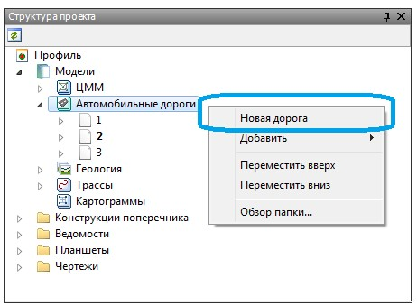
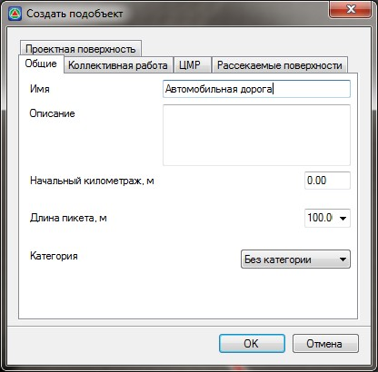

# Создание подобъекта Автомобильная дорога

Проект может содержать неограниченное число подобъектов типа **Автомобильная дорога**. Редактирование возможно только текущей модели.

По умолчанию, при создании проект уже содержит один подобъект, без данных, с наименованием **Ось**. Процедура выбора текущей модели была описана в разделе **Структура проекта**.

Если необходимо создать дополнительный подобъект данного типа:

1. В окне **Структура проекта** щелкните правой кнопкой мыши по группе моделей **Автомобильные дороги** и выберите из появившегося контекстного меню пункт **Новая дорога**:

   

2. В открывшемся диалоговом окне задайте в поле **Имя** наименование создаваемого подобъекта и нажмите **ОК**:

   

   

   На вкладках данного окна расположены основные настройки создаваемого подобъекта, они будут описаны ниже в соответствующем разделе.

   

В результате, будет создан новый подобъект типа **Автомобильная дорога**, по умолчанию он будет текущим.
