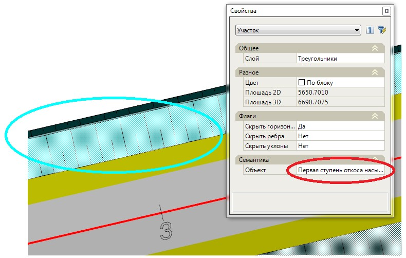
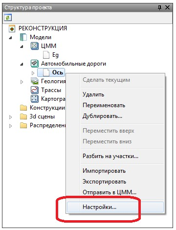
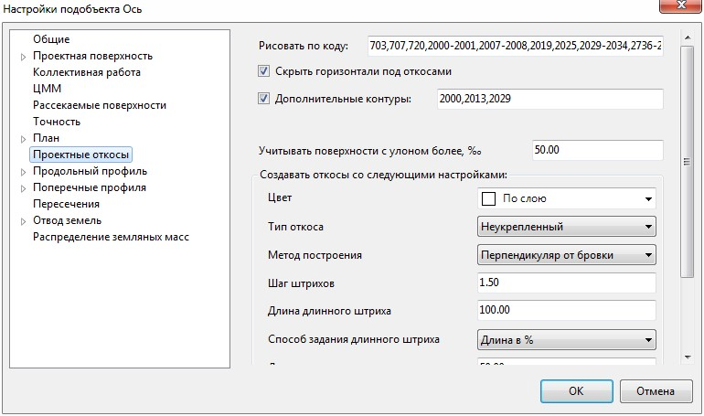
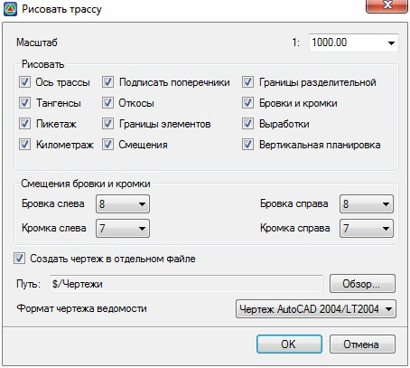

# Отрисовка проектного решения на плане

В качестве отображения проектного решения в окне План используется проектная поверхность, которая в виде треугольников (участков), раскрашенных различными цветами, наглядно показывает элементы дороги (проезжую часть, обочины и т.д.), а для обозначения откосов используется специальный условный знак. Выполнив необходимые настройки отрисовка проектного решения на плане может производится в автоматическом режиме.



1. Отрисовка и настройка **Проектной поверхности** подробно описана в текущем томе гл. **Настройка** подобъекта **Автомобильные дороги**, вкладка [Проектная поверхность](setting_subobject.md).
2. Механизмы отрисовки условного знака Откос см. ниже.



## Проектные откосы

Отрисовка **Проектных откосов** в качестве условного знака на плане осуществляется по закодированным участкам (группам треугольников) проектной поверхности:

В случае когда опция **Строить проектную поверхность динамически** включена, то **Проектные откосы** строятся автоматически, если опция динамического перестроения проектной поверхности выключена, то откосы перестраиваются с помощью функции **План-Рисовать проектные откосы**.



1. Опция **Строить проектную поверхность динамически** включается в **Настройках подобъекта**:

   

2. При выключенной **Динамической поверхности** для отрисовки **Проектных откосов** выберите меню **План – Рисовать проектные откосы**.



Для того чтобы настроить по каким участкам проектной поверхности необходимо выполнять отрисовку условного знака откос, а также задать другие параметры отображения условного знака:

1. В окне **Структуре проекта** щелкните правой кнопкой мыши по наименованию соответствующего подобъекта и выберите из появившегося контекстного меню пункт **Настройки**:

   

2. В открывшемся окне перейдите на вкладку **Проектные откосы**:

   

   В поле **Рисовать по коду** задаются коды участков проектной поверхности по которым необходимо рисовать условный знак откос.

   

   1. По умолчанию в данном поле перечислены все стандартные коды заложений откосов, кюветов и т.д.
   2. Коды перечисляются через запятую, а также может быть использован символ дефис.

   

   При включении опции **Скрыть горизонтали под откосами**, тем участкам которые заданы в поле **Рисовать по коду** автоматически будет присвоен флаг **Скрыть горизонтали**.

   Включение опции **Дополнительные контуры** позволяет оконтурить замкнутой полилинией перечисленные участки, указанные в данном поле.

   

   В дальнейшем данные контуры (замкнутые полилинии) могут быть использованы для оформительских целей, например для штриховки или заливки данных участков.

   

   В поле **Учитывать поверхности с уклоном более** задается минимальное значение уклона при котором на участке проектной поверхности будет рисовать условный знак откос.

   В поле **Создавать откосы со следующими настройками** задаются параметры отрисовки условного знака откос.

## Отрисовка проектного решения версия 7.x.

Функция позволяет отрисовать или сохранить в файл чертежа элементы подобъекта (ось, тангенсы, вершины и т.д.) в качестве примитивов.



 Данная опция оставлена для совместимости с предыдущей версией программы Топоматик Robur - Автомобильные дороги 7.5.. На текущий момент вместо данной «устаревшей» функции для создания чертежа плана используется механизм Экспорта ситуации (меню **Проект – Экспортировать - Ситуация**), который были описаны в Документации [гл. Создание чертежа ситуационного плана](../../doc/create_drawings_plan.md).



Для этого:

1. Выберите меню **Рисовать – Элементы плана версии 7.5**, откроется диалоговое окно:

   

2. Задайте необходимые параметры и нажмите **Ок**. В результате выбранные элементы будут отрисованы в окне План в виде примитивов.
