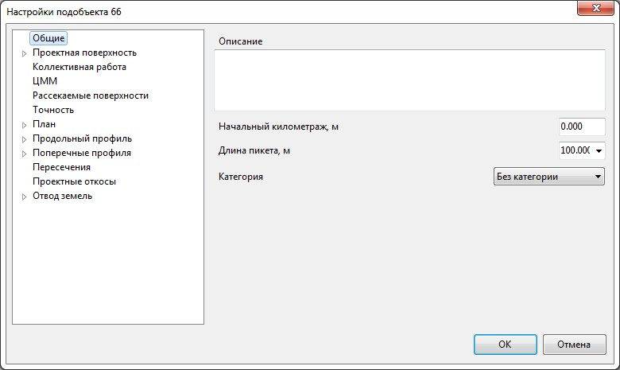
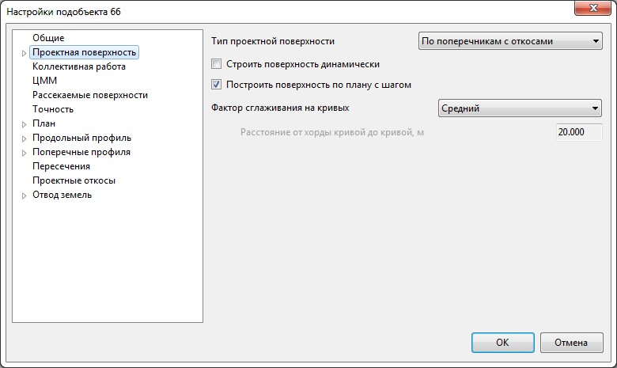
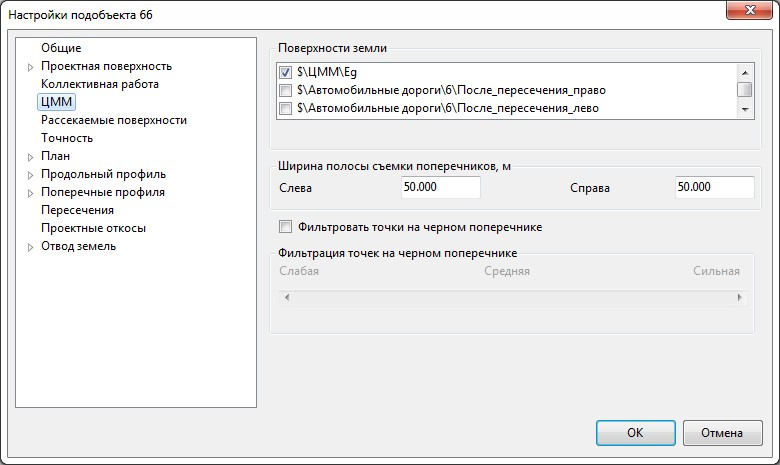
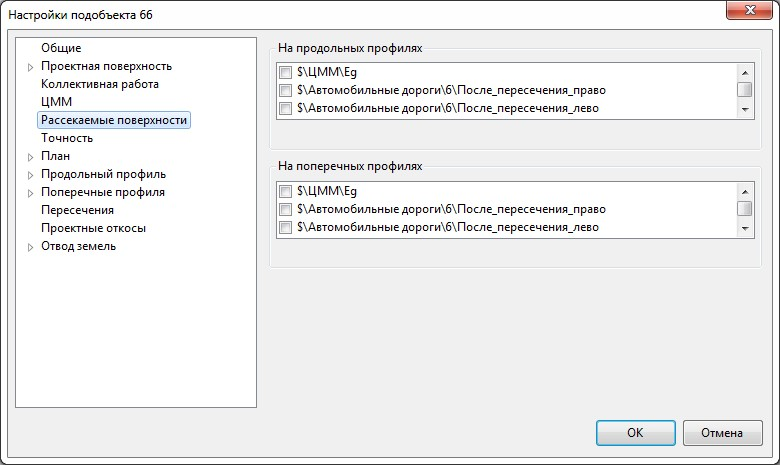

# Настройки подобъекта Автомобильная дорога

Для задания или изменения каких-либо настроек текущего подобъекта:

1. В окне **Структура проекта** щелкните правой кнопкой мыши по его наименованию и выберите из появившегося контекстного меню пункт **Настройки**:

   На вкладке **Общие** расположены следующие настройки:

   

   

   В данном окне задаются настройки текущей модели подобъекта **Автомобильные дороги**. Для задания настроек по умолчанию для вновь создаваемых моделей, а также общих настроек проекта, воспользуйтесь элементом меню **Сервис - Настройки**.

   

   * **Описание** – при необходимости в данном поле можно задать дополнительное описание редактируемого подобъекта.
   * **Начальный километраж** – в данном поле задается номер начального километра трассы, если необходимо чтобы он был отличен от нулевого.
   * **Длина пикета** - поле ввода для изменения длины пикета.
   * **Категория** – из выпадающего списка выбирается категория Автомобильной дороги. В зависимости от заданной категории принимаются по умолчанию определенные нормативные параметры используемые при дальнейшем проектировании.

    

   На вкладке **Проектная поверхность** расположены следующие настройки:

   

   * **Тип проектной поверхности** - выберите необходимый тип построения проектной поверхности.
   * **Строить поверхность динамически** – если данная опция установлена, то при любых модификациях текущего подобъекта, к примеру: при изменении его плановой или профильной геометрии, будет автоматически перестраиваться проектная поверхность дороги.

     

     1. Построение проектной поверхности на протяженной трассе может занимать определенное время. По этому, для ускорения работы с функциями по редактированию подобъекта данная опция по умолчанию отключена.
     2. Если опция автоматического построения поверхности отключена, но ее всю же необходимо перестроить, то воспользуйтесь для этого функцией **Поверхность – Построения - Перестроить проектную поверхность**.

     

   * **Построить поверхность по плану с шагом** – если данная опция установлена, то становится доступный селектор **Фактор сглаживания на кривых**.

     Может быть выбран один из вариантов: **Слабый, Средний, Сильный** и **Пользовательский** фактор сглаживания.

     В зависимости от выбранного фактора сглаживания, при построении проектной поверхности будет добавлено определенное количество дополнительных сечений на криволинейном участке трассы, что приведет к более правильному и сглаженному ее отображению. Количество введенных дополнительных сечений определяется расстоянием от хорды кривой до кривой. Т.е. чем сильнее фактор сглаживания тем большее количество сечений будет добавлено на криволинейном участке и поверхность будет более сглаженная.

     

     При выборе **Пользовательского фактора** сглаживания, появляется возможность указать необходимое максимальное расстояние от хорды кривой до кривой.

     

   На вкладке**ЦММ** задаются следующие настройки:

   

   В поле **Поверхность земли** поставьте опции напротив тех поверхностей, по которым по умолчанию должны формироваться черные профили и сечения при использовании соответствующих функций. Таких поверхностей может быть несколько.

   **Ширина полосы съемки поперечников** - может задаваться в тех случая, когда в качестве **ЦММ** используются очень большие поверхности и поперечные профили по оси должны формироваться не на всю ширину съемки, а лишь в определенном коридоре трассы.

   **Фильтровать точки на черном поперечнике** – включение данной опции позволяет на черных поперечниках отсеять часть точек, которые образовались в результате пересечения ребер поверхности с линией сечения под малым углом. При **Слабой фильтрации**, отсеиваются ребра лежащие под углом менее 1 градуса к линии сечения, при **Сильной фильтрации**, отсеиваются ребра, лежащие под углом менее 6 градусов.

   На вкладке **Рассекаемые поверхности** задаются следующие настройки:

   

   На данной вкладке установите опции напротив тех поверхностей, которые должны дополнительно, помимо черной земли, рассекаться и отображаться на продольных и поперечных профилях. В качестве рассекаемых поверхностей могут также быть использованы проектные поверхности других подобъектов.

2. Установите необходимые настройки текущего подобъекта и нажмите **ОК**.
