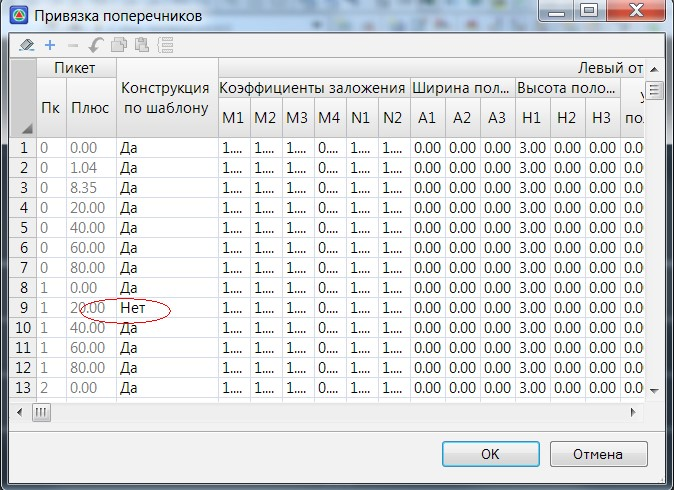
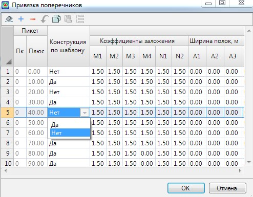

# Редактирование конструкции на конкретном пикете

**Robur** позволяет редактировать конструкцию поперечного профиля на конкретном пикете без создания шаблона. Вы можете добавить или удалить элементы конструкции, поменять свойства элементов или же вовсе запроектировать уникальную конструкцию. В этом случае, конструкция на данном пикете будет уникальна, при ее построении шаблон игнорируется. Такой поперечник помечается знаком *

В таблице привязки поперечников в свойствах поперечник помечается как индивидуальный (не по шаблону):

Если какой-либо отдельный поперечный профиль был отредактирован путем добавления в него новых элементов или удаления существующих, но в последствии потребовалось отменить эти изменения, т.е. вернуть первоначальную конструкцию, которая была применена в качестве шаблона на заданном участке, в поле **Конструкция по шаблону** для соответствующего поперечника установите параметр **Да**:

