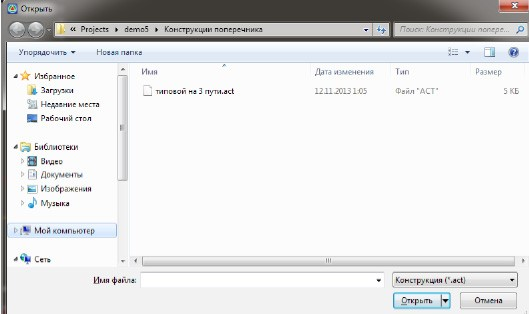
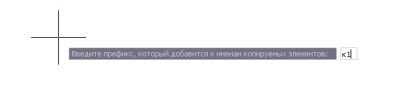

# Импортировать конструкцию со вставкой

Функция предназначена для добавления созданного и сохраненного ранее элемента конструкции к текущей конструкции поперечного профиля.

Для этого:

1. Выберите меню **Поперечник - Утилиты - Импортировать конструкцию со вставкой**, откроется диалоговое окно выбора импортируемой конструкции:

   

2. Выберите файл конструкции и нажмите **Открыть**.
3. Во избежания дублирования имен имеющейся на текущем поперечнике и вставляемой конструкции, в строке динамического ввода введите имя префикса, который добавится ко всем названиям импортируемой конструкции:

   

   Нажмите **Enter** для подтверждения действия

4. Укажите узел вставки импортируемой конструкции.

В результате на текущий поперечник будет вставлен дополнительный элемент конструкции, относительно указанной точки вставки.
