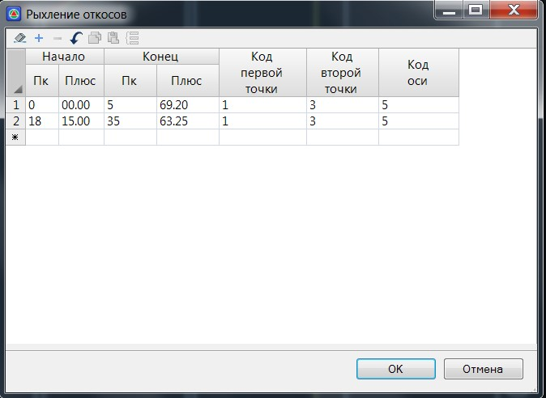

# Рыхление откосов

Данная поправка используется преимущественно при реконструкции земляного полотна. Для того чтобы заполнить таблицу **Рыхление откосов**:

1. Выберите элемент меню **Поперечник – Поправки – Рыхление левого/ правого откоса**, откроется следующие окно:

   

   **Начало/ конец** – в данных полях задаются пикеты участка, в пределах которого будет осуществляться рыхление откоса.

   **Код первой\ второй точки** – данными кодами определяются участки существующих откосов. По умолчанию: подошва - код №1 и бровка код №3. Если на поперечниках заданные коды отсутствуют, то участки рыхления не будут определяться программой.

   **Код оси** – данный код также используется для определения участков рыхления (сторонности откосов).

   Рыхление откосов схематично показано ниже:

   

2. Задайте необходимые параметры и нажмите **ОК**.

В результате, на поперечниках, на заданном участке будет создан соответствующий элемент конструкции.



 Объем работ по рыхлению откосов рассчитывается и заносится в отдельную графу стандартной ведомости объемов работ.


