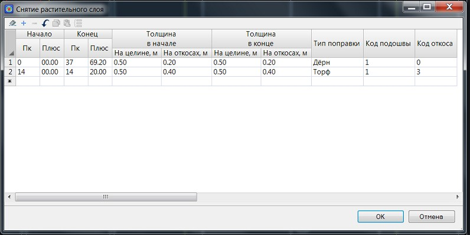

# Снятие растительного слоя

В данной таблице задается величина снятия растительного слоя, на целине и откосах существующей насыпи (в случае ее реконструкции). Для задания величины снятия растительного слоя:

1. Выберите элемент меню **Поперечник – Поправки – Снятие растительного слоя**, откроется диалоговое окно:

   

   **Начало/ Конец** – в данных полях задается пикет начала и конца участка, в пределах которого будет осуществляться снятие растительного грунта.

   **На целине, м** – в данном поле задается толщина снятия растительного слоя целине.

   **На откосах, м** – толщина снятия растительного слоя на откосах существующей насыпи.

   

   При задании различной толщины растительного слоя в начале и в конце, в пределах участка его толщина будет вычисляться интерполяцией.

   

   **Тип поправки** – из выпадающего списка выбирается соответствующий тип поправки. В случае если был выбран тип - **Торф**, то объем снимаемого грунта при формировании стандартной ведомости объемов будет занесен в столбец **Выторфовывание**.

   **Код подошвы/ откоса** – данными кодами определяются участки существующих откосов, а также, область, где не нужно снимать растительный слой. По умолчанию: код **«1 Подошва существующая»** и код **«3 Бровка существующая»**. Если на поперечниках данные коды отсутствуют, то снятие растительного слоя будет производиться с параметрами заданными для целины, на всю ширину дороги, без учета наличия конструкции существующего земляного полотна.

   Расчетные схемы снятия растительного слоя только на целине, а также целине и откосах представлены ниже:

   

   

2. Задайте необходимые параметры снятия растительного слоя и нажмите **ОК**.

В результате, на всех поперечниках, попадающих на выбранный участок, будет отображаться конструкция снятия растительного слоя, а объемы работ (насыпь, выемка, кюветы и т.п.) будут рассчитываться с учетом предварительного снятия слоя растительного грунта.



 Принципы подсчета основных объемов работ подробно описаны в соответствующем разделе (См. раздел [Расчет объемов на примере типовых поперечников](../calculation_volumes_major_works/general_principle.md)).


