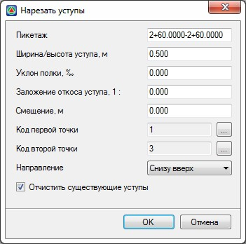

# Нарезка уступов

При устройстве досыпки или уширения существующего земляного полотна на откосах может производиться нарезка уступов. В программе предусмотрен автоматический и ручной способ задания уступов.



Ручной способ создания уступов описан в разделе [Уступы](../creation_individual_elements/macroposthonia_ledge.md).



Для того чтобы задать параметры нарезки уступов автоматически:

1. Выберите элемент меню: **Поперечник – Поправки - Нарезка уступов**, откроется диалоговое окно:

   

    **Пикетаж** – поле ввода для задания участка, в пределах которого будет осуществляться нарезка уступов.

   

   Все параметры уступов подробно описаны в разделе [Уступы](../creation_individual_elements/macroposthonia_ledge.md).

   

   **Направление** – в данном селекторе выбирается один из способов нарезки уступов на поперечнике:

   * При выборе направления **Сверху вниз**, уступы определяются параметром **Высота уступа** и нарезка уступов будет производиться от верхней точки с кодом к нижней, причем высота последнего уступа будет подобрана по факту т.е. до нижней точки с кодом:

     

   * При выборе направления **Снизу вверх**, уступы определяются параметром **Ширина уступа** и нарезка уступов будет производиться от нижней точки с кодом к верхней, причем размеры последнего уступа будут подобраны по факту т.е. до верхней точки с кодом:

     

    **Ширина\ Высота уступа, м** – в зависимости от выбранного направления, в данном поле ввода будет задаваться ширина или высота уступов.

    **Код первой\ второй точки** – выбираются коды точек, между которыми производится нарезка уступов.

    Включенная опция **Очистить существующие уступы** позволяет удалить все ранее добавленные конструкции Уступы с поперечников.

2. Задайте необходимые параметры и нажмите **Ок**. В результате на выбранном участке поперечников будет произведена нарезка уступов. При необходимости параметры любой конструкции Уступ могут быть отредактированы через окно **Свойства**.



 Объем работ по нарезке уступов рассчитывается и заносится в отдельную графу ведомости. Общий объем насыпи и выемки рассчитывается без учета данного вида работ. При необходимости получения итогового объема насыпной части с учетом предварительной нарезки, эти виды работ (насыпь и нарезка уступов) необходимо просуммировать самостоятельно.


