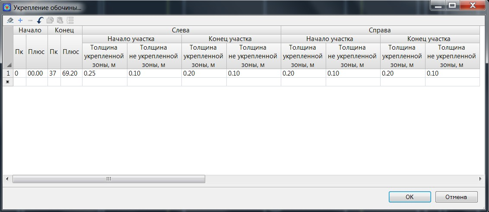

# Укрепление обочин

Для того чтобы задать укрепления обочин:

1. Выберите элемент меню **Поперечник – Поправки - Укрепление обочин**, откроется следующие диалоговое окно:

   

   **Толщина укрепленной зоны, м** – в данном поле задается толщина укрепленной части обочины.

   **Толщина не укрепленной зоны, м** – в данном поле задается толщина не укрепленной части обочины.

   Конструкция укрепления обочины схематично показана ниже:

   

2. Задайте необходимые параметры укреплений обочины и нажмите ОК.

В результате, на всех поперечниках, попадающих на выбранный участок, будут отображаться конструкции укреплений обочин, а объем их присыпной части будет рассчитываться с учетом данных укреплений.



 Принципы подсчета основных объемов работ подробно описаны в соответствующем разделе (См. раздел [Расчет объемов на примере типовых поперечников](../calculation_volumes_major_works/general_principle.md)).


