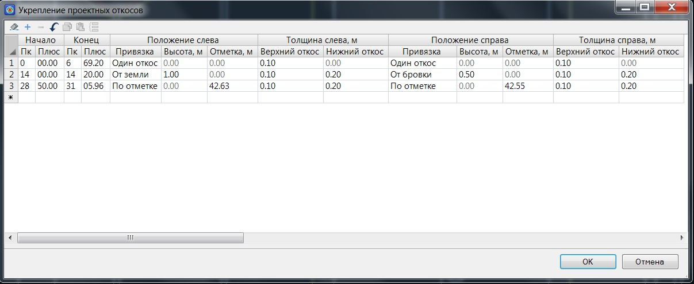

# Укрепление откосов

Для того чтобы заполнить таблицу укрепления откосов:

1. Выберите элемент меню **Поперечник – Поправки - Укрепление откосов**, откроется диалоговое окно:

   

   **Начало/ Конец** - в данных полях задаются пикеты участка, в пределах которого будет осуществляться укрепление откоса.

   **Привязка** – в данном селекторе из выпадающего списка выбирается один из способов укрепления откоса на поперечнике. Возможны следующие варианты:

   * При выборе привязки **Один откос**, укрепление задается на всю высоту откоса постоянной толщиной. Поля с наименованием **Высота, Отметка** и **Нижний откос** будут неактивны. Толщина укрепления откоса для левой и правой стороны задается в поле **Верхний откос**. Конструкция укрепления откоса данного типа схематично показана ниже:

     

   * При выборе типа привязки **От бровки** или **От земли**, укрепление кювета может быть задано на определенную высоту, задаваемую в соответствующем поле и отмеряемую либо от бровки откоса, либо от его подошвы. В данном случае станут активными поля **Верхний откос** и **Нижний откос** - задайте для них необходимое значение толщины укрепления. Конструкция укрепления откоса данного типа схематично показана ниже:

     **От бровки**
     

     **От земли**
     

   * При выборе привязки **По отметке**, также задается толщина укрепления верхнего и нижнего откоса. В отличие от вышеописанного типа укрепления (от бровки или от подошвы), граница укрепления верхнего и нижнего откоса определяется не высотой, а абсолютной отметкой, задаваемой в соответствующем поле. Конструкция укрепления откоса данного типа схематично показана ниже:

     

2. Задайте необходимые параметры укрепления откосов и нажмите **ОК**.

В результате, на всех поперечниках, попадающих на выбранный участок, будет отображаться конструкции укреплений проектных откосов, а объемы работ (насыпь, выемка, конструкция дорожной одежды и т.п.) будут рассчитываться с учетом данных укреплений.



Принципы подсчета основных объемов работ подробно описаны в соответствующем разделе (См. раздел [Расчет объемов на примере типовых поперечников](../calculation_volumes_major_works/general_principle.md)).


