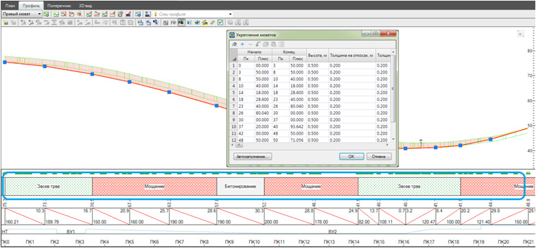

# Визуальное редактирование укреплений кюветов

Для создания и редактирования укреплений кюветов предусмотрен специальный графический редактор. Назначение типов укреплений и границ их участков осуществляется визуально, непосредственно на продольном профиле водоотводного сооружения.

Данные, которые заданы в таблице поправок **Укрепление левого\ правого кюветов**, могут быть визуально отображены и отредактированы в окне **Профиль** в области сетки профиля:



1. Данные таблицы Укрепления кюветов и соответствующей панели окна Профиль взаимосвязаны
2. Для отображения данных по укреплению убедитесь, что видимость панели Укрепление кюветов в Свойствах панели профиля включена:

   



Функциональные возможности в панели **Укрепление кюветов**:

## Добавление нового участка укрепления

1. В области, где не задан тип укрепления, щелкните правой кнопкой мыши и выберите опцию Добавить укрепление:

   

2. В результате, будет назначен участок укрепления:

   



 При добавлении участка укрепления, его границы изначально совпадают с пикетами вершинами переломов профиля, между которыми создавался участок. По умолчанию применяется тип укрепления - Засев трав.



## Удаление участка укрепления

Для удаления необходимого участка укрепления, щелкните правой кнопкой мыши в пределах его области, в контекстном меню выберите пункт **Удалить укрепление**:

В результате необходимый участок будет удален.

## Редактирование участков укрепления

1. Изменение положения границ участков укрепления удобно производить визуально с помощью левой кнопки мыши. Для этого, наведите курсор мыши на границу участка укрепления и зажмите левую кнопку мыши, не отпуская кнопку, перетащите границу участка визуально или с привязкой к заданной вершине перелома профиля (риски синего цвета):

   

2. Для изменения свойств участка укрепления (тип укрепления, пикет начала\конца, толщина и т.д.) щелкните по его области правой кнопкой мыши, в контекстном меню выберите пункт Редактировать укрепление, откроется диалоговое окно:

   

   

   1. Для удобства редактирования, необходимая строка таблицы будет автоматически выделена.
   2. Данные в таблицах Укрепления левого\ правого кюветов и соответствующей панели окна Профиль взаимосвязаны.

   

3. Задайте необходимые параметры и нажмите **ОК**. Все изменения отобразятся на панели Укрепление кюветов в окне Профиль.
