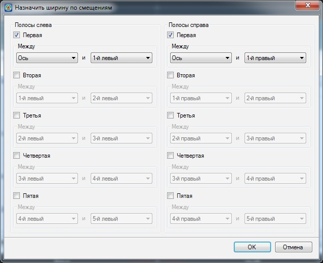

# Задание ширины проезжей части по смещениям

Данная функция позволяет автоматически заполнять большую часть таблиц полос мастера параметров конструкции, опираясь на значения соответствующих профилей и смещений. К примеру, можно проектировать вертикальную планировку проезжей части оперируя продольными профилями, а затем заполнить этими данными таблицу полос мастера параметров конструкции (ширины и уклоны), и в последствии уже работать с ней.

Ширина основных полос проезжей части, обочины или разделительной полосы может быть заполнена как разность между двумя выбранными смещениями. Для того чтобы задать ширину основной полосы по смещениям:

1. Нажмите пиктограмму **Назначить ширину по смещениям** , расположенную в верхней части окна. Откроется следующее окно:

   

2. Установите галочки над номерами полос, для которых необходимо будет заполнить значения ширин и выберите соответствующие номера смещений. Ширина полосы на всем протяжении будет определяться как разность значений смещений.

   

   Значения смещений и рассчитываемая ширина всегда принимаются положительными, соответственно последовательность выбора смещений (от 1-го до 2-го или от 2-го до 1-го) значения не имеет.

   

3. Нажмите **Ок**.

В результате, ширина каждой выбранной полосы будет вычислена как разность значений между двумя смещениями.
