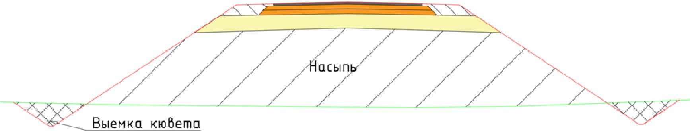
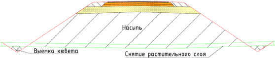
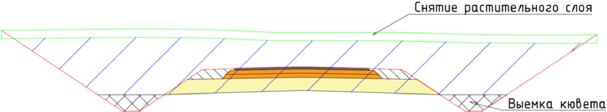
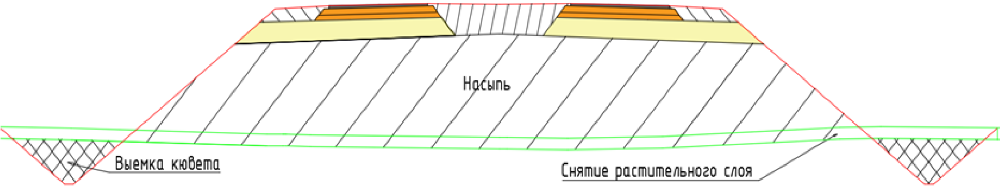
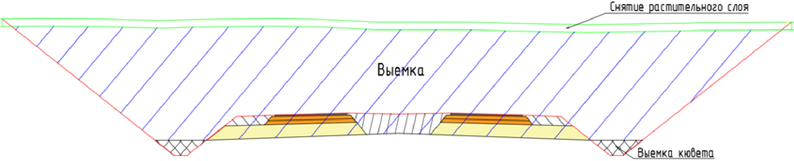

# Земляные работы

В данном подразделе показаны принципы расчета основных объемов земляных работ (насыпь, выемка, кюветы и т.п.). Данные элементы заносятся в стандартную ведомость (**Ведомость площадей и объемов**, вкладка **Земляные работы**) и рассчитываются согласно схемам приведенным ниже.

#|
||Насыпь под конструкцию без разделительной полосы и снятия растительного слоя|||
||Насыпь под конструкцию без разделительной полосы, со снятием растительного грунта|||
|| Выемка под конструкцию без разделительной полосы со снятием растительного грунта|||
||Насыпь под конструкцию с разделительной полосой|||
||Выемка под конструкцию с разделительной полосой|||
|# {wide-content}
