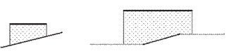
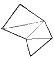

# Общие принципы

В данном разделе приведены основные конструкции поперечных профилей и перечислены виды объемов работ, которые могут быть рассчитаны с помощью стандартной ведомости.

**Общие принципы расчета объемов на основе контуров поперечных профилей.**

**Robur** рассчитывает объем как полусумму площадей на соседних поперечниках, умноженную на расстояние между ними.

Площадь геометрической фигуры, образующей конструктивный слой или элемент может быть определена двумя способами:

* Площадь между двумя ломаными линиями, образующими границы слоя.
* Площадь замкнутого контура.

При подсчете площадей между двумя ломаными линиями одна из линий условно считается верхней границей, а вторая – нижней.

Для подсчета площадей, область разбивается на элементарные фигуры (трапеции или треугольники). Площадь областей, когда верхняя граница слоя проходит выше нижней, считается насыпью. А наоборот – выемкой.

Левая и правая границы подсчета площадей определяются концами верхней граница слоя. Нижняя граница продлевается вправо и влево по необходимости.

На левом рисунке верхняя граница слоя короче нижней, а на правом рисунке нижняя короче верхней, поэтому к ее крайним левой и правой точкам программа автоматически добавляет горизонтальные сегменты.

Для подсчета площади замкнутого контура, он разбивается на треугольники, площадь которых суммируется.

Для проверки и контроля правильности рассчитываемых значений площадей и объемов по поперечникам имеется интерактивный функционал, который включает в себя:

1. Возможность выделения любого конструктивного элемента на поперечнике и отображение его параметров в окне Свойств.
2. Вывод значений площади и длины по контуру при наведении на него курсора мыши:

   

3. Включение/ выключение отображения элементов поперечного профиля, а также изменение цвета данных элементов производится с помощью выпадающего списка слоев.

   



В данном разделе рассматривается принцип расчета объемов работ на основе стандартных элементов конструкций поперечного профиля. Дополнительные способы подсчета объемов работ будут описаны далее (см. [Способы подсчета объемов](../../../annex/methods_calculation_volumes.md)).

