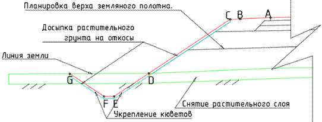

# Планировочные объемы

Объемы планировочных работ рассчитываются, в зависимости от типа поперечного профиля, согласно расчетным схемам представленным ниже.

## Насыпь

## Насыпь с учетом предварительного снятия растительного слоя и укреплениями откосов (общий случай)

Где:

* **АВ** – планировка укрепленной части обочины.
* **ВС** – планировка не укрепленной части обочины.
* **СD** – планировка откоса.
* **DE, FG** – планировка откоса кювета.
* **EF** – Планировка дна кювета.

## Полунасыпь – Полувыемка

Где:

* **АВ** – планировка укрепленной части обочины.
* **ВС** – планировка не укрепленной части обочины.
* **СD** – планировка откоса насыпи.
* **GН** – планировка откоса выемки.
* **DE, FG** – планировка откоса кювета.
* **EF** – Планировка дна кювета.

## Выемка

Где:

* **АВ** – планировка укрепленной части обочины.
* **ВС** – планировка не укрепленной части обочины.
* **СD** – планировка откоса насыпи.
* **GН** – планировка откоса выемки.
* **DE, FG** – планировка откоса кювета.
* **EF** –планировка дна кювета.
