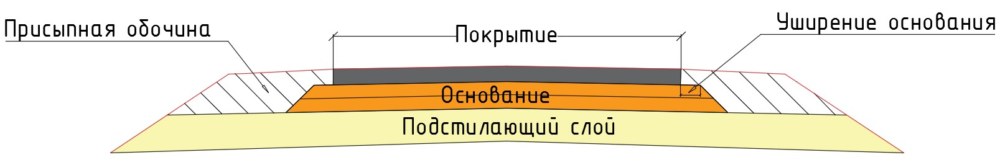
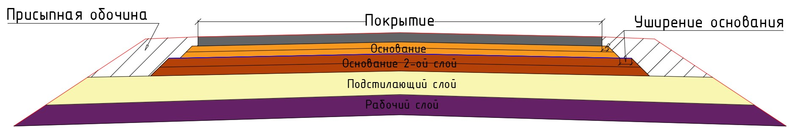
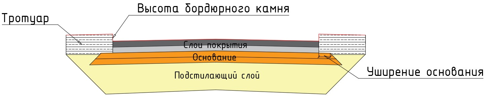
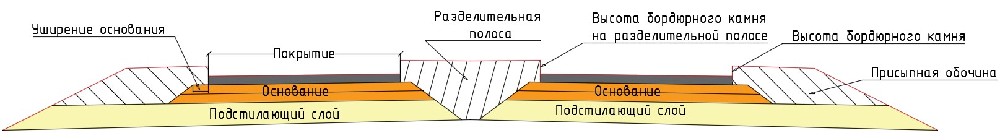
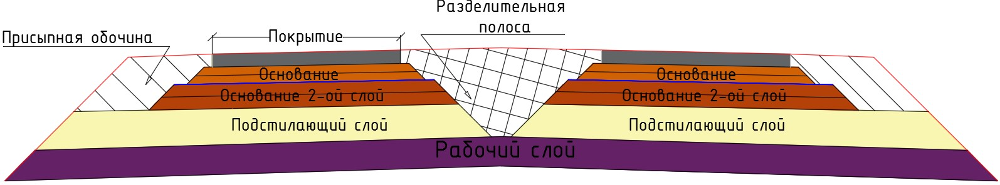
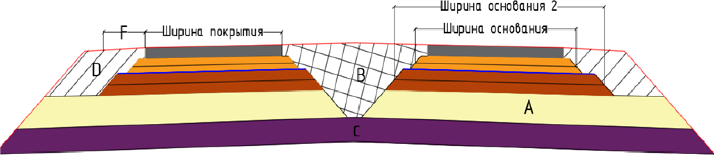

# Дорожная одежда

В данном подразделе приведены основные типы конструкций поперечных профилей. На них схематично показан принцип подсчета основных объемов работ по дорожной одежде, которые заносятся в стандартную ведомость (**Ведомость площадей и объемов**, вкладка **Конструкция дорожной одежды**).

#|
||Дорога без разделительной полосы|||
||Дорога без разделительной полосы с двумя слоями основания|||
||Дорога без разделительной полосы, с дорожной одеждой корытного типа, с тротуарами и многослойным покрытием| ||
||Дорога с разделительной полосой|||
||Дорога с разделительной полосой и с двумя слоями основания|||
||Принцип подсчета площадей и длин основных контуров дорожной одежды

Где:

* **A** – Площадь подстилающего слоя.
* **B** – Площадь разделительной полосы.
* **C** – Площадь рабочего слоя.
* **D** – Площадь присыпной обочины.
* **F** – Ширина укрепленной части обочины.
| {.cell-align-center}||
|# {wide-content}
