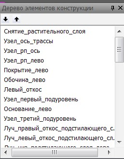

# Создание и редактирование конструкций

Как уже было отмечено, для проектирования поперечных профилей используется специальный инструментарий – конструкции. Применение конструкций позволяет решать следующие задачи:

1. Проектировать типовые поперечники, путем табличного задания параметров.
2. Легко создавать поперечники абсолютно любой конфигурации (бордюры, газоны, тротуары, слои дорожной одежды, георешетки , укрепления и. т. д.).
3. Редактировать конкретный поперечник на отдельном пикете.

Конструкция состоит из узлов, лучей и контуров, называемых далее элементами конструкции.

Помимо названных, имеются специализированные элементы для учета снятия растительного слоя, подрубки, выравнивания, привязки откосов и подсчета объемов.

При проектировании индивидуального поперечника, пользователь последовательно добавляет в конструкцию элементы и задает их параметры, а программа запоминает последовательность действий и сохраняет ее в дереве элементов конструкций:

В дальнейшем, когда конструкция применяется на поперечнике, **Robur** последовательно вставляет на данный поперечник все элементы конструкции из дерева, в точности повторяя действия пользователя, которые он выполнял при создании конструкции.

По своей сути конструкция – это макрос. Конструкцию можно скопировать, сохранить в файл, применить на конкретном пикете, либо на участке трассы.
