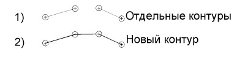
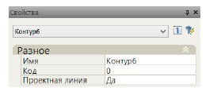

# Объединение контуров

Данная команда позволяет объединить два произвольных контура. В результате, создается новый контур на основе двух исходных, если эти контуры не соединены, то они соединяются в ближайших друг к другу точках. 

 

Для этого:
1. Выберите на вкладке **Контуры** команду **Объединение контуров**.
2. Последовательно левой кнопкой мыши укажите на экране первый и второй контур. Параметры вновь созданного контура можно изменить в стандартном окне **Свойства**:

   

