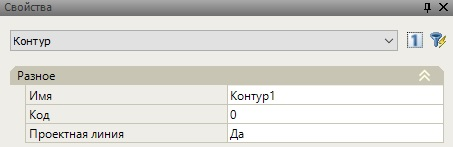

# Создание контуров

**Контур** - это линия, которая получается в результате объединения нескольких узлов.

Для того что бы построить контур:

1. Выберите команду **Контур** на вкладке **Контуры**.
2. Последовательно укажите на экране узлы, через которые должен пройти создаваемый контур.

Основные параметры созданного контура могут быть изменены в стандартном окне **Свойства**:

Контуру может быть задано любое имя и код.

Опция в поле **Проектная линия (ДА\ НЕТ)** определяет будет ли являться контур проектной линией и отображаться красным цветом на поперечнике и по которому в дальнейшем создается проектная поверхность, а также в шапке поперечного профиля будут отражены по нему данные (ширины, уклоны и т.п.).



 В случае наличия на поперечнике несколько Проектных линий, проектная поверхность и отображаемые в шапке поперечного профиля данные будут формироваться по самой верхней проектной линии.



При визуализации модели данный контур будет отображаться в соответствии с заданным кодом. Также код контура может использоваться при формировании определенных разбивочных ведомостей. К примеру, если созданному пользовательскому контуру задать код из стандартного кодификатора, то при формировании выходных документов все данные по нему будут писаться в соответствующие графы.



 Перечень основных семантических кодов узлов и контуров используемый при формировании выходных ведомостей представлен в отдельном [приложении](../../../annex/list_standard_codes_and_variable_designs.md). 

