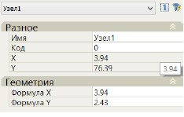
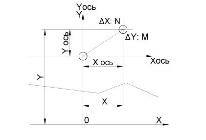

# Создание узлов

Для того чтобы визуально вставить узел в произвольном месте графического поля окна **Поперечник** выберите на вкладке **Узлы** команду **Узел**. Затем, левой кнопки мыши укажите в графическом поле его место вставки. При выборе места вставки будут динамически отображаться смещение и превышение относительно оси. После указания места вставки узел с автоматически присвоенным ему номером появляется в **Дереве конструкции**. Если выбрать в **Дереве конструкций** или непосредственно в графическом поле предварительно введенный узел, то в окне **Свойства** будут отображены его основные параметры:

**Имя** любого элемента можно изменить. Важно помнить, что оно должно быть уникальным.

В качестве узла привязки можно использовать точки на черном поперечнике, если они закодированы любым кодом кроме 0 (на месте этой точки автоматически создается узел).

**X,Y** - в данных строках отображаются абсолютные отметки и расстояния от оси до узла. Данное поле является информационным и не доступно для редактирования.

**Формула X,Y** - в строках формул могут быть записаны любые числовые значения, выражения, а так же могут быть использованы переменные, например E (возвышение, м), О (уширение, м), для того что бы при изменении возвышения или уширения в соответствующей таблице не пришлось повторно задавать данные значения в свойствах элементов конструкции поперечников. Также в выражениях можно использовать произвольные переменные пользователя значения которых задаются в специальных таблицах. Работа с пользовательскими переменными будет описана далее в разделе **Дополнительные переменные**. Что касается использования специальных выражений и условий, то более подробно их примеры будут описаны далее в отдельном приложении.

Расположение осей системы координат поперечного профиля схематично показано ниже:

Где:

**X, Y** - координаты узла в системе координат поперечного профиля отображаемые в полях X,Y.
**X ось, У ось** - смещение и превышение узла относительно оси, задаваемые в полях **Формула X** и Формула У. Значения превышений и смещений, откладываемых против направления координатных осей, т.е. вниз или влево, вводятся с отрицательным знаком.