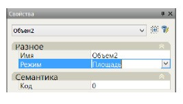
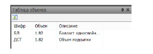
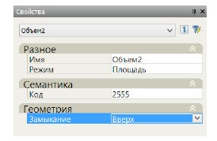
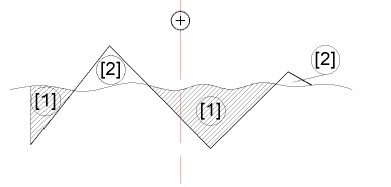

# Создание объемов

**Объем** – специализированный элемент, создаваемый на основе контура или группы контуров используемый для расчета площадей и объемов. Данный элемент может быть создан несколькими способами, которые описаны ниже.



Данная функция позволяет создать элемент **Объем** на основе предварительно построенного контура. Для этого:

1. Выберите на вкладке **Объемы** команду **Объем по контуру**.
2. Укажите в графическом поле контур, на основе которого должен быть создан **Объем**.

Параметры вновь созданного контура можно изменить в стандартном окне **Свойства**:

**Имя** – данное поле является информационным и не обязательным для заполнения.

**Режим** – из выпадающего списка выбирается правило, по которому необходимо рассчитывать данный элемент. Возможные варианты: площадь, длина, количество. Соответственно между поперечниками будет определяться объем, площадь или количество данных элементов.

**Код** - в данном поле пользовательскому объему задается соответствующий код из таблицы шифров и объемов. Для назначения семантического кода щелкните левой кнопкой по данному полю и нажмите кнопку 

Откроется окно стандартной библиотеки:

Выберите соответствующий код из списка и нажмите **ОК**.

Если необходимо присвоить контуру новый код, которого нет в стандартном списке кодов, то данный код необходимо предварительно создать в **Таблице шифров и объемов**. Процедура дополнения таблицы шифров и объемов была описана [ранее](../working_with_palette_and_tree_elements.md) в соответствующем разделе.

После того как **Объему** будет присвоен код, данные по нему автоматически появятся в окне **Таблица объемов**:



 Если на поперечнике более одного элемента Объем с одинаковым кодом, то при подсчете объемов работ значения по ним будут складываться.







Данная команда создает элемент **Объем**, который считается между двумя исходными контурами. Для создания данного элемента:

1. Выберите на вкладке **Объемы** команду **Объем на пересечении контуров**.
2. Последовательно укажите в графическом поле исходные контуры, на основе которых должен быть создан **Объем**.

В результате, в палитре конструкции и на поперечнике появится новый элемент **Объем**.

Параметры вновь созданного элемента можно изменить в стандартном окне **Свойства**:

Данный элемент, как правило, представляет собой объем типа насыпь/выемка между исходными контурами. При этом параметр **Замыкание** и определяет, что необходимо считать, насыпь или выемку. Если исходные контуры были замкнуты, то объемом будет площадь их пересечения друг с другом. Если контуры не замкнуты, то они будут замкнуты автоматически, причем первый сверху, а второй снизу. Если наоборот указать сначала верхний, а потом нижний контур то **Объем** не будет создан. В этом случае необходимо пересоздать контур или в свойствах объема изменить тип замыкания на **«Вниз»**. 

1. \- Объем, который получается, если сначала был выделен плавный контур, а потом ломаный и тип замыкания «Вниз». А также, если сначала был выделен ломаный контур, а потом плавный и замыкание «Вверх»
2. \- Объем, который получается, если сначала был выделен плавный контур, а потом ломаный и тип замыкания «Вверх». А также, если сначала был выделен ломаный контур, а потом плавный и замыкание «Вниз».



и

В отличии от предыдущих элементов данный объем является стандартным. Он строится по заданному правилу с учетом положения линии проектной и существующей земли, конструкции дорожной одежды и дополнительных поправок к объемам.

В случаях, когда создаются собственные конструкции поперечных профилей, не на основе стандартных, данный элемент будет отсутствовать и при необходимости его можно добавить самостоятельно.

Для добавления в общий список дерева элементов конструкции элемента Объем насыпи и выемки щелкните левой кнопкой мыши по его наименованию в окне **Палитра конструкции**.

В результате данный элемент отобразится в списке окна **Дерево элементов конструкции**, а при наличии всех необходимых исходных контуров на поперечном профиле построятся контуры объемов насыпи и выемки, площади которых отобразятся в окне **Таблица объемов**. Данный элемент должен располагаться в самой нижней части списка дерева элементов конструкций.





Конструкция **Контур+Объем** позволяет единовременно создать две соответствующих конструкции.





 Для вывода данных по индивидуальной конструкции Объем используйте Рабочую ведомость. 



