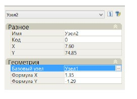

# Ввод узла относительно другого узла

Данная команда работает аналогично стандартному вводу узла. Однако, положение узла задается не от начала системы координат (оси трассы), а от любого предварительно введенного узла. Для этого:

1. После вызова данной команды, укажите в графическом поле узел, который будет являться базовым.
2. После указания базовой точки, укажите левой кнопкой мыши в графическом поле положение вставляемого узла.

Параметры узла введенного относительно другого можно подкорректировать в стандартном окне **Свойства**:

В поле **Базовый узел** можно изменить точку привязки. Значения или выражения в полях **Формула X,Y** задаются относительно базового узла.
