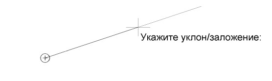
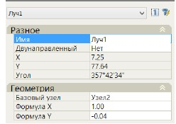

# Ввод лучей

**Лучи** - это вспомогательные элементы, как правило они используются для определения положения узлов.



Для ввода луча:

1. Выберите команду **Луч** на вкладке **Лучи**.
2. Укажите левой кнопкой мыши базовый узел, к которому должен быть привязан луч. Относительно данной точки он будет поворачиваться.
3. Задайте уклон луча. Уклон можно назначить визуально, задав направление луча в графическом поле. Для задания точного уклона или его заложения укажите его значение в строке динамического ввода:

   

   При движении курсора в окне динамического ввода автоматически отображается текущее значение уклона. При уклоне меньше 200 ‰ - значение уклона отображается в промилле. При уклоне начиная с 1:5 отображается значение заложения. Основные параметры введенного луча можно изменить в стандартном окне** Свойства**.

   

   Для изменения уклона луча измените значения или выражения в полях **Формула X,Y**. В данных полях задается заложение и превышение луча:

   



Данная функция позволяет ввести луч, проходящий через два заданных узла. В данном случае уклон луча при вводе не задается, а всегда рассчитывается программой автоматически на основе положения двух исходных узлов, через которые он проходит. Для ввода луча по двум точкам необходимо последовательно указать первый и второй узел привязки.

