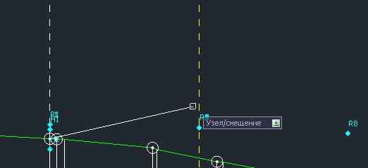
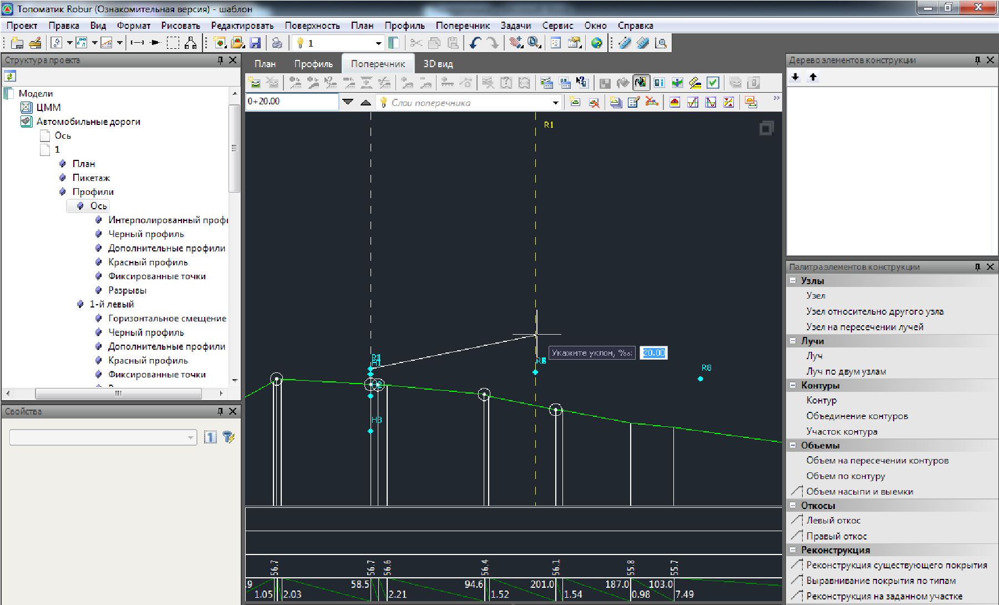
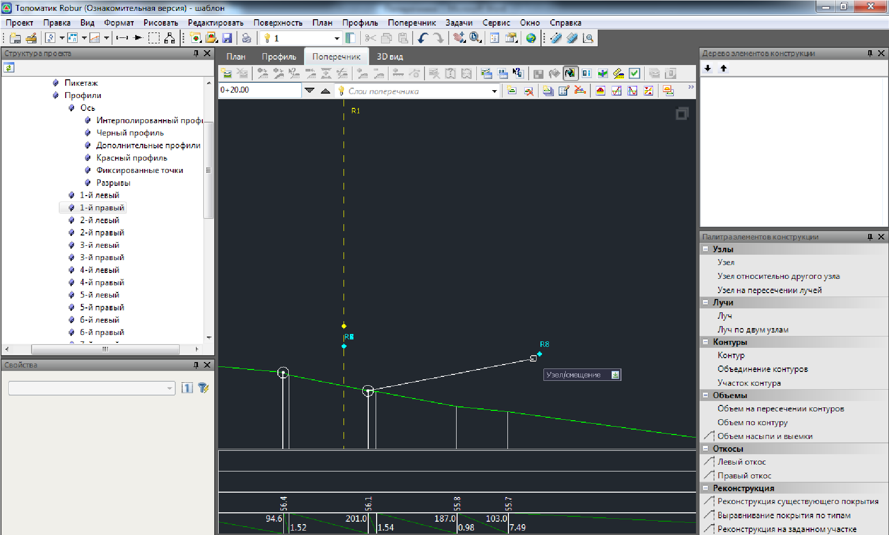
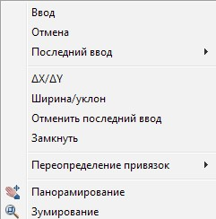

# Макропостроения

В данной группе находятся вспомогательные функция построения контура конструкции и конструктивных слоев дорожной одежды.

## Навести контур

Данная функция позволяет строить контур проектной линии без предварительно созданных узловых точек, привязываясь к характерным смещениям, границам полос, параметры которых были предварительно заданы в мастере параметров конструкции, а также задавая собственные значения ширин, уклонов или превышений непосредственно в строке динамического ввода. Узловые точки в процессе построения контура создаются автоматически. При привязке их к предварительно созданным смещениям или границам полос их свойства (выражения Формула X и Формула Y) заполняются автоматически.

Для того чтобы воспользоваться данной функцией:

1. В окне **Палитра конструкции** щелкните левой кнопкой мыши по элементу **Навести контур**.
2. Курсор примет форму прицела, а в динамической строке будет запрос **Узел/ Смещение**.

   При этом, на поперечнике автоматически подсветятся элементы к которым можно привязываться при построении контура:

   

   Желтым цветом показывается положение линии смещения, которые предварительно были заданы. Последовательность действий по заданию горизонтальных смещений относительно оси трассы была описана ранее в соответствующем разделе. Номер линии смещения подписывается рядом с ней в верхней части графического поля.

   Голубым цветом подписываются точки границ полос конструкции или глубин подуровней. Все данные параметры задаются в мастере параметров конструкции (**Поперечник - Задать параметры конструкции**), который был описан ранее.

   Укажите в качестве первой узловой точки контура положение оси трассы, щелкнув по данной точке левой кнопкой мыши.

   Следующую точку контура можно задать несколькими способами:

   

   * **Привязка к смещению**.

     Для этого щелкните левой кнопкой мыши по соответствующей линии смещения в графическом поле окна **Поперечник**. В динамической строке уточните значение поперечного уклона:

     

     Если по данному смещению был запроектирован свой продольный профиль и к нему необходимо привязаться, то для этого щелкните левой кнопкой мыши по соответствующей точке в графическом поле окна **Поперечник**. В этом случае значение уклона в строке динамического ввода запрашиваться не будет.

   * **Привязка к данным таблицы параметров конструкции.**

     Если необходимо привязать узел контура к границе одной из полос или глубине подуровня, параметры которых были предварительно заданы в мастере параметров конструкции, просто щелкните левой кнопкой мыши по соответствующей точке на поперечнике (они отображаются синим цветом).

   * **Задание расстояний и превышений, либо уклонов относительно предыдущего узла.**

     Для этого щелкните правой кнопкой мыши, появится контекстное меню, из которого можно выбрать необходимый способ ввода:

     

     **∆X/∆Y** – значение превышения и заложения, задаваемые в строке динамического ввода. Если смещение происходит против положительного направления горизонтальной или вертикальной оси, то оно вводится с отрицательным знаком.

     **Ширина/уклон** – значение расстояния и уклона задаваемые в строке динамического ввода. Если уклон создаваемого сегмента направлен вверх, то его значение вводится с отрицательным знаком.

     **Отменить последний ввод** - отменяет ввод последнего введенного сегмента контура.

     **Замкнуть** - данная команда позволяет замкнуть вводимый контур, соединяя его начальную и конечную узловую точку.

3. Введите аналогичным образом остальные узловые точки контура. Для выхода из режима создания контура щелкните правой кнопкой мыши и выберите из появившегося контекстного меню пункт **Ввод**.

В результате созданный контур отобразится в графическом поле окна **Поперечник**.

### Разрывы верха земляного полотна

Наличие данного элемента конструкции позволяет производить модификацию контуров на участках пересечений, где основная дорога совмещается с примыкающей.

В случаях, когда создаются собственные конструкции поперечных профилей, не на основе стандартных, элемент конструкции **Разрывы верха земляного полотна** будет отсутствовать и при необходимости его можно добавить самостоятельно в общее дерево элементов.

Для добавления данного элемента щелкните дважды левой кнопкой мыши по его наименованию в окне **Палитра конструкции**. В результате данный элемент отобразится в списке окна Дерево элементов конструкции. В этом списке данный элемент должен располагаться ниже конструктивных слоев дорожной одежды, которые будут модифицироваться.

Все параметры разрывов задаются в таблице **Разрывы** расположенной в **Дереве структуры проекта**. Последовательность действий по созданию пересечений и примыканий будет описана далее в соответствующем разделе.

### Обрезка контура конструкции

Данная функция позволяет выполнять обрезку замкнутых и не замкнутых элементов по заданному контуру.

Для этого:

1. В окне **Палитра конструкции** щелкните левой кнопкой мыши по элементу **Обрезка** по конструкции.
2. Курсор примет форму прицела, левой кнопкой мыши щелкните по контуру, который необходимо обрезать.
3. Укажите левой кнопкой мыши контур, по которому будет осуществляться обрезка.

В результате выбранные контуры будут модифицированы по заданной границе.