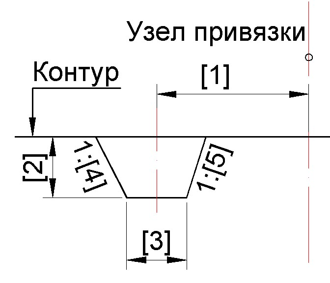

# Дренаж

При вставки дренажной конструкции необходимо указать контур относительно которого она должна строиться, а также узел привязки относительно которого задается смещение данного элемента. 

* 1 - Расстояние до оси дренажа.
* 2 - Глубина.
* 3 - Ширина дна.
* 4,5 - Заложение внутреннего и внешнего откоса.

