# Мастер формул

Для написания сложных выражений содержащих математические функции и использующих переменные в программе предусмотрен **Мастер формул**. Для вызова данного мастера нажмите кнопку , расположенную в соответствующем поле окна **Свойства**.

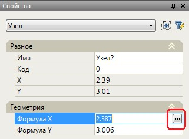

Откроется окно **Мастер формул**:

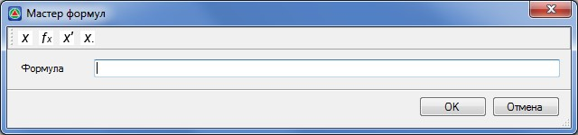

В поле формула пишется выражение. Если в процессе написания выражения нужно использовать переменную или математическую функцию, можно воспользоваться следующими кнопками:

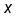- переменная подобъекта. При нажатии этой кнопки открывается окно со списком переменных данного подобъекта. При перемещении по списку переменных в правой части возникает подсказка с описанием переменной:

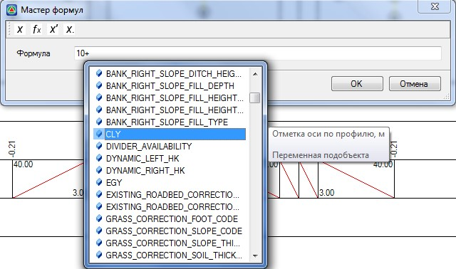

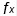- функция. При нажатии этой кнопки открывается окно со списком математических функций, которые могут быть использованы при написании формул. При перемещении по списку функций в правой части возникает подсказка с правилом ввода функции:

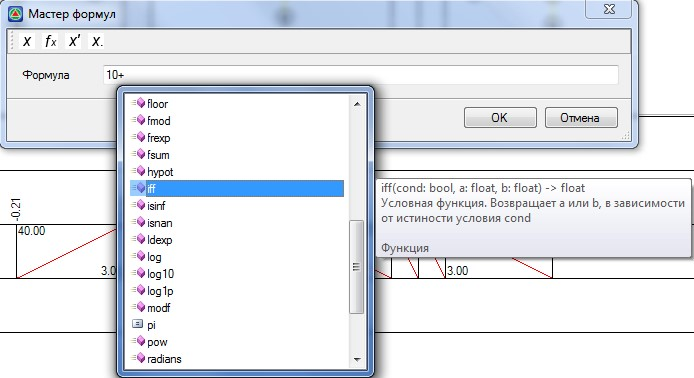

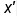- переменная с другого подобъекта. При нажатии этой кнопки, программа попросит указать с какого подобъекта считывать переменную. Далее работа функции аналогична функции **Переменная подобъекта.**

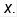- свойство элемента конструкции. Данная команда используется в случае, когда нужно сослаться на какой либо параметр с другого элемента (конструкции или узла). Например, нужно что бы для узла 3 смещение по Y было бы таким же как у узла 2. Для этого, выбираем узел 3, находим нужный параметр и вызываем окно Мастер формул.Далее, выбираем функцию Свойство элемента конструкции, находим элемент, с которого нужно взять параметр – узел 2:

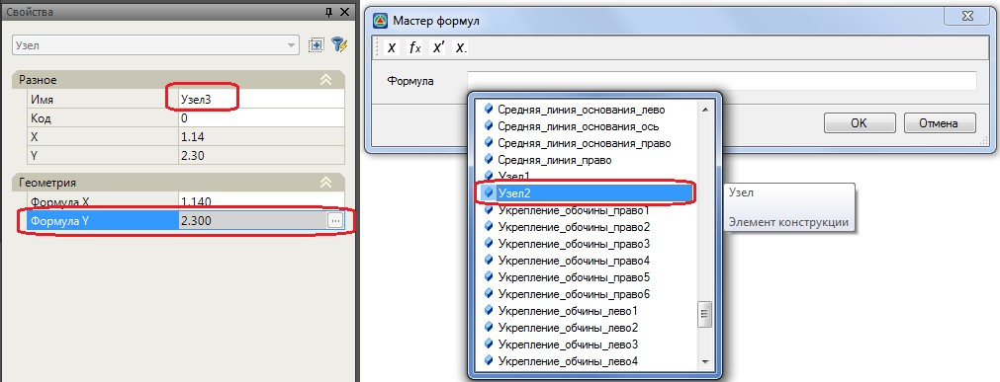

После выбора узла 2 программа покажет свойства, которыми обладает выбранный элемент. Выбираем свойство, которое нам необходимо:

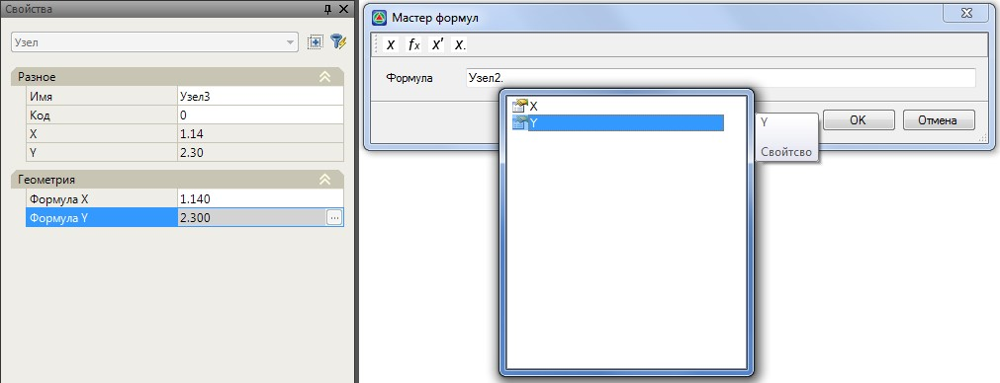

В поле **Формула** формируется окончательное выражение:

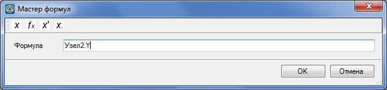

Для выбора элементов при использовании окна Мастера формул необходимо левой клавишей мыши дважды нажать на элемент из списка. Программа добавит выбранный элемент в формулу.

При нажатии **ОК** в окне **Мастер формул** созданное выражение отобразится на панели свойств в строке ввода нужного параметра.



 **Мастер формул** – не обязательный элемент. Если пользователь знает как прописать переменную, математическую функцию или параметр конструкции, он может прописать ее в нужном поле окна **Свойства**, не используя **Мастер формул**.

