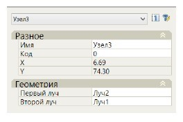

# Узел на пересечении лучей

Данная команда позволяет привязать узел к точке пересечения двух предварительно созданных лучей. Последовательность действий по созданию и редактированию лучей будет описана ниже.

После вызова данной команды необходимо последовательно указать первый и второй луч. В качестве второго луча может быть использован контур уже предварительно созданной конструкции поперечного профиля или линия черной земли. В результате, в соответствующей точки пересечения лучей или луча и контура будет создан новый узел. Его основные параметры можно отредактировать в стандартном окне **Свойства**:

