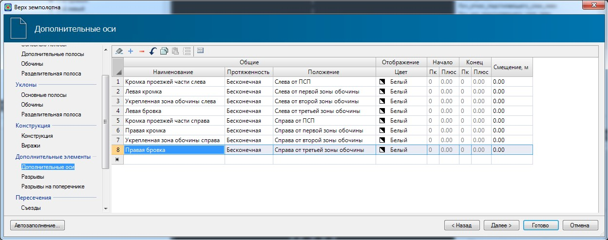
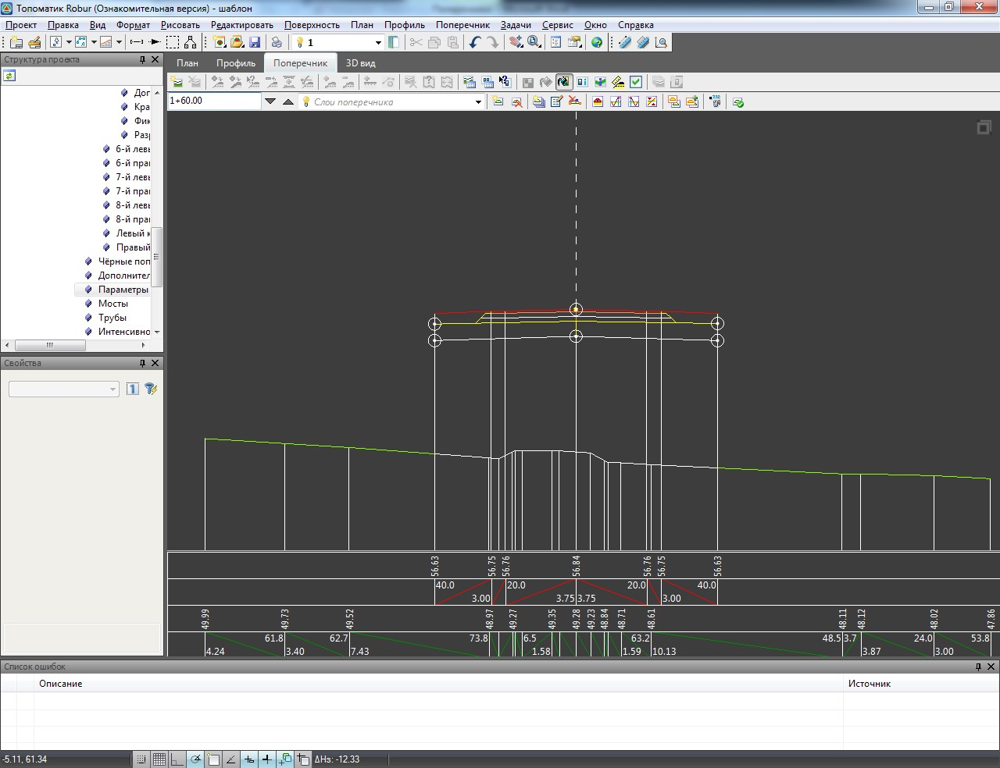

# Дополнительные оси

В данной таблице могут быть заданы оси, которые необходимо отрисовывать в окне **План**. Это могут быть как линии границ полос конструкции поперечника, так и произвольные вспомогательные построения:

Каждая вспомогательная ось задается следующими параметрами:

**Наименование** - данное поле является информационным и необязательным для заполнения.

**Протяженность** - из выпадающего списка выбирается способ задания границ отрисовки данной оси. Если установлен параметр **Бесконечная**, то ось будет рисоваться на всем протяжении трассы. Если же установить параметр **Конечная**, то станут доступны столбцы **Начало** и **Конец**, где можно задать пикеты границ участка, в пределах которого должна рисоваться полоса.

**Положение** - дополнительная ось задается смещением относительно какой-либо полосы конструкции поперечника. В данном поле из выпадающего списка выбирается соответствующая полоса.

**Смещение** - расстояние между дополнительной осью и полосой выбранной в поле 
**Положение**. При положительном значении смещения ось будет смещена от основной (разбивочной оси), а при отрицательном значении смещена к ней.

Для выхода из мастера задания параметров конструкции с применением всех заданных параметров нажмите **Готово**.

В результате программа применит соответствующий шаблон конструкции, с заданными параметрами и отобразит его в окне **Поперечник**:

