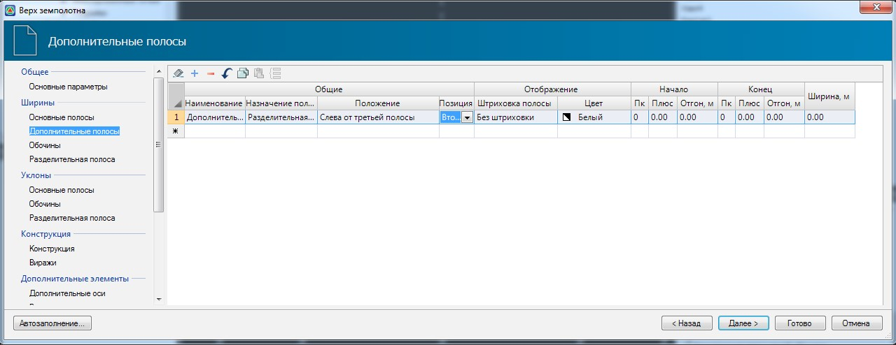
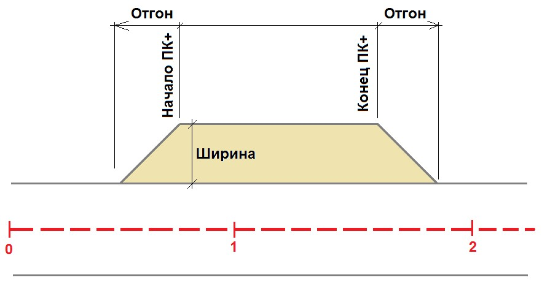

# Дополнительные полосы

В данной таблице указываются параметры дополнительных полос, такие как:

**Наименование** - описание полосы, данное поле является информационным и не обязательным для заполнения.

**Положение** - из выпадающего списка выбирается номер основной полосы, к внешней стороны которой будет добавлена дополнительная полоса.

**Позиция** - в случае, если задано несколько дополнительных полос, причем в селекторе **Положение** выбран один и тот же номер полосы, то приоритет расчета и отображения дополнительных полос будет определяться исходя из выбранного номера в поле **Позиция**.

**Отображение** - для наглядности отображения дополнительной полосы на плане ей может быть задан индивидуальный цвет и заливка. Данные параметры выбираются в соответствующих полях из выпадающих списков.

**Начало/Конец** - в данной группе полей задаются пикеты начального и конечного отгона дополнительной полосы, а также длины самих отгонов.

**Ширина** - в данном поле задается значение ширины дополнительной полосы.

