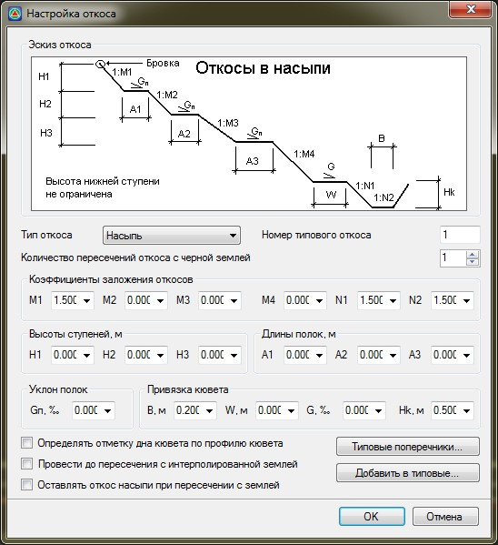
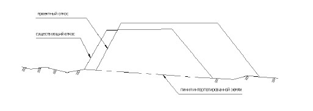
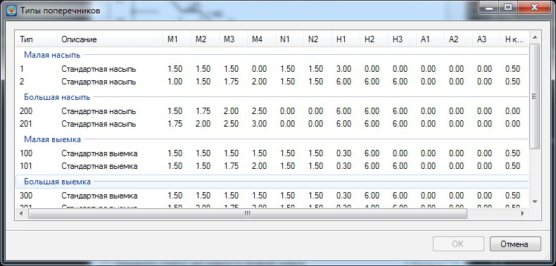

# Назначение параметров откосов

Для того, чтобы назначить параметры стандартной конструкции откоса с левой стороны, выберите элемент меню **Поперечник – Левый откос**, либо **Поперечник – Правый откос** для задания параметров откоса справа. Откроется диалоговое окно:

**Тип откоса** – выбирается из выпадающего списка. В зависимости от выбранного типа в верхней части диалогового окна появляется соответствующая схема откоса с его основными параметрами.

**Количество пересечений откоса с землей** – задает количество пересечений проектного откоса с линией земли. Этот параметр может использоваться в сложных стесненных условиях проектирования, например при реконструкции.

Все остальные параметры (коэффициенты заложения откосов, высоты ступеней, длины и уклоны полок, параметры канав) отражены на схемах для каждого соответствующего типа откоса.

**Провести до пересечения с интерполированной землей** - данная опция позволяет осуществлять обрезку проектного откоса по линии интерполированной земли при ее наличии:



Функция создания и редактирование линии интерполированной земли была описана ранее в соответствующем разделе (см. раздел [Создание интерполированного профиля](../../../rb_survey/alg/track_profile/create_interpolated_profile.md)).



**Определять отметку дна кювета по профилю кювета** – если данная опция установлена, то на текущем поперечнике отметки дна кювета будут привязаны к заранее запроектированному продольному профилю. При изменении профиля кювета, отметки дна на поперечниках будут также динамически изменяться. Процедура создания и редактирования продольного профиля кюветов будет описана далее. Снятие данной опции, отменяет связь глубины дна на конкретном поперечном профиле с соответствующим профилем кювета. В результате, поле Hk,m станет активным, где можно будет задать необходимую глубину канавы.

**Оставлять откос насыпи при пересечении с землей**. По умолчанию **откос Насыпи** строится до линии земли, при включении опции **Оставлять откос насыпи при пересечении с землей**, откос продлевается до **Высоты первой ступени** (H1).



 Данная опция используется при проектировании откосов в полу насыпях.



**Типовые** – при выборе этой кнопки открывается библиотека ранее созданных откосов сохраненных как типовые.

Для применения типового откоса щелкните дважды левой кнопкой мыши по соответствующей строке списка . Его параметры отобразятся в основном диалоговом окне, при необходимости они могут быть отредактированы:

Для создания откоса с заданными параметрами нажмите **ОК**.

В результате конструкция откоса соответствующего типа будет создана и отобразится на поперечном профиле.



 Откос создается с соответствующей стороны на текущем поперечнике. Если до выполнения данной функции была выбрана группа поперечников, то текущий откос будет применен на всем этом участке.

