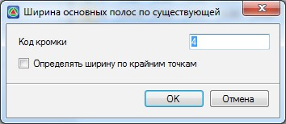

# Задание ширины проезжей части по существующей

Зачастую возникает необходимость получения ширины проезжей части совпадающей с существующей шириной, например при капитальном ремонте. Для этого границы существующей проезжей части должны быть прокодированы в **ЦММ** или на черных поперечниках. Для автоматического заполнения ширин основных полос по границам существующего покрытия:

1. Нажмите пиктограмму **Назначить ширины по существующей**, расположенную в верхней части окна  . Откроется следующие окно:

   

2. В поле **Код кромки** укажите семантический код, который для них был задан. Установите опцию **Определять ширину по крайним точкам**, если на поперечнике имеется более двух существующих кромок, к примеру при наличии разделительной полосы. Нажмите **Ок**.

В результате, расстояния между проектной осью и существующими кромками перенесутся в таблицу **Ширины основных полос**.