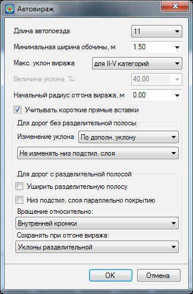
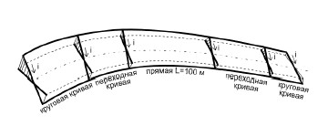
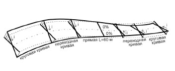
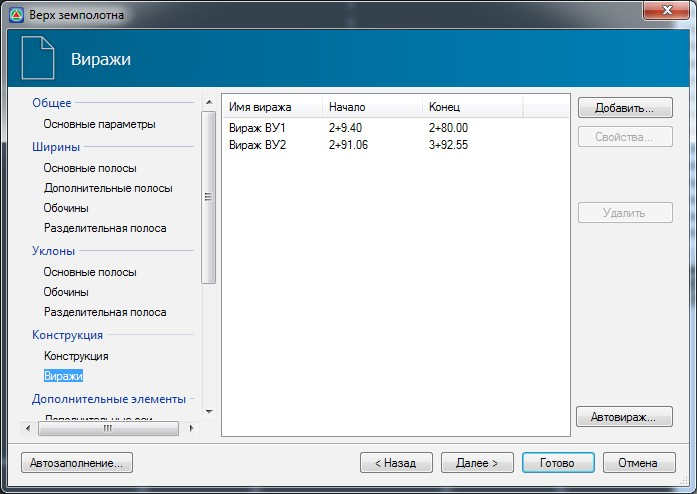
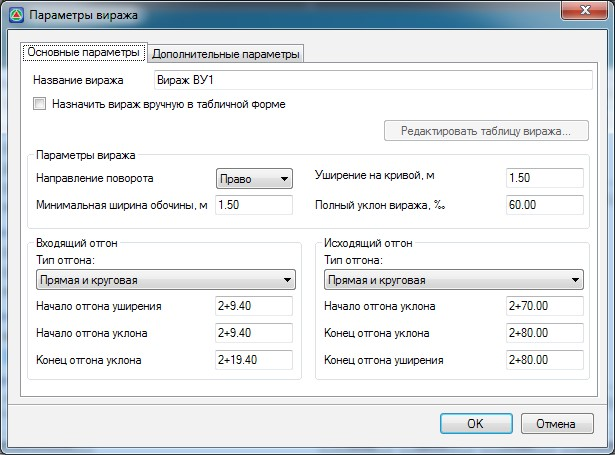

# Автовираж

Для заполнения таблицы в автоматическом режиме нажмите кнопку **Автовираж**. Откроется следующие окно: 

**Длина автопоезда** – из выпадающего списка выберите максимальную длину автопоезда, которая будет учтена при расчете уширения проезжей части на кривой малого радиуса.

**Минимальная ширина обочины** – в данном поле задается минимально допустимое значение ширины обочины при уширении проезжей части.

**Максимальный уклон виража** – уклон виража может быть определен автоматически, в зависимости от категории дороги и дополнительных условий, выбираемых из выпадающего списка. При выборе в данном списке пункта **Задать уклон** станет активно дополнительное поле **Величина уклона**, где можно самостоятельно задать требуемое значение.

**Начальный радиус отгона виража** – в данном поле может быть задано значение радиуса переходной кривой, при достижении которого начинается отгон виража. По умолчанию отгон выполняется от начала переходной кривой.

**Учитывать короткие прямые вставки** – определяет необходимость учета прямых вставок незначительной протяженности между смежными закруглениями. Если данная опция отключена, то отгон виража осуществляется без их учета прямых вставок вне зависимости от их протяженности. Если данная опция включена, то отгон виражей осуществляется по следующим правилам:

* Если две смежные кривые в плане обращены в одну сторону и прямая вставка между ними отсутствует, то односкатный поперечный профиль следует принимать непрерывным на протяжении двух кривых. В случае наличия прямой вставки <100 м между смежными кривыми, уклон на данной прямой вставке принимается односкатный и равный уклону основных полос. 

   

* Если две смежные кривые в плане обращены в разные стороны и прямая вставка между ними менее 40 м. или отсутствует, то отгон виража осуществляется от середины прямой вставки или на стыке двух клотоид, где поперечный уклон проезжей части и обочины принимается равным нулю. Отгон уширения осуществляется от начала переходной кривой.

  

* Если две смежные кривые в плане обращены в разные стороны и прямая вставка между ними менее 60 м, но более 40 м, то на стыке прямой и клотоидой с каждой стороны, задается уклон обочины равный уклону на прямолинейном участке.

**Вращение низа подстилающего слоя** – из выпадающего списка выбирается один из вариантов вращения подстилающего слоя на вираже:

* **Низ подстилающего слоя параллельно покрытию** – на протяжении всего отгона виража уклон низа подстилающего слоя будет равен уклону проезжей части.
* **Не изменять низ подстилающего слоя** - на протяжении всей длины отгона низ подстилающего слоя остается неподвижным.
* **Вращать низ подстилающего слоя** - низ подстилающего слоя остается до определенного момента неподвижным, затем осуществляется резкое изменение уклона низа подстилающего слоя и дальнейшее его вращение с верхом покрытия происходит одновременно.

**Изменение уклона** - из выпадающего списка выбирается один из вариантов вращения верха покрытия и обочины на вираже:

**По дополнительному уклону** - переход от двускатного к односкатному осуществляется путем вращения внешней пр. части вокруг оси пр.части до достижения односткатного профиля с уклоном равным уклону пр. части при двускатном профиле, затем вращением всего верха конструкции вокруг оси до уклона виража. При расчете виража определяется условный дополнительный уклон кромки проезжей части примыкающей к внешней обочине. В случае если дополнительный уклон менее трех промилле, то на участке перехода от двускатного поперечного профиля к односкатному с уклоном равным уклону пр.части на прямолинейном участке, создается дополнительный продольный уклон Lдоп.=3 ‰, путем определения по формуле (см. ТП 503-0-45) длины участка перехода от двускатного поперечного профиля к односкатному с уклоном равным уклону пр. части.

**Последовательно** - отгон уклона осуществляется аналогично схеме «по дополнительному уклону» за исключением неучитывания дополнительного уклона (3 промилле)

**Пропорционально** - переход от двускатного к односкатному осуществляется путем вращения отдельно каждой пр. части вокруг оси до достижения уклона виража, т.е. значение приращения уклона для каждой пр. части рассчитывается отдельно, пропорционально длине.

Также в данном окне могут быть заданы дополнительные настройки, характерные для дорог с разделительной полосой:

* **Уширить разделительную полосу** – предусматривает уширение разделительной полосы при отгоне виража.
* **Вращение относительно** – из выпадающего списка выбирается ось относительно которой будет происходить вращение проезжей части (внутренняя кромка, середина проезжей части или внешняя кромки).

**Сохранять при отгоне виража** – в случае если осями вращения не являются внутренние кромки, то из выпадающего списка выбирается, каким образом производить вращение проезжих частей, c сохранением заданных значений уклонов разделительной полосы, либо превышения оси при выполнении отгона виража: 

Схема отгона виража с сохранением уклона на разделительной полосе с внутренней стороны относительно направления поворота:

При нажатии кнопки **ОК** происходит автоматический пересчет виражей и заполнение их параметров в таблицу. Однако необходимо иметь ввиду, что все параметры, заданные в таблице виражей до запуска этой функции, будут удалены и заменены расчетными параметрами функции.



Функция Автовираж может работать только на криволинейных участках трассы, имеющих переходные кривые. Если переходные кривые отсутствуют, то необходимо воспользоваться ручным режимом расчета виражей.



При нажатии кнопки **ОК** происходит автоматический пересчет виражей и заполнение их данных в таблицу параметров конструкций:

Параметры любого отдельного виража полученные автозаполнением при необходимости могут быть отредактированы. Для этого выберите соответствующий вираж из списка и нажмите кнопку **Свойства**. Откроется окно основных параметров виража:

Параметры данного окна будут описаны ниже в разделе [Общий случай создания виража](general_case_creating_superelevation.md).