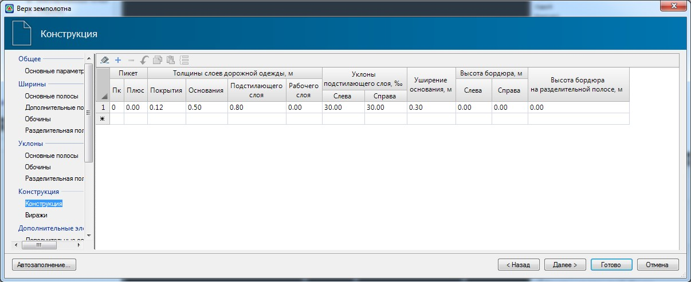

# Конструкция

 

В данной таблице задаются основные параметры конструкции дорожной одежды, такие как: толщины слоев дорожной одежды, уклон подстилающего слоя, уширение основания, а также участок, в пределах которого действуют данные параметры.