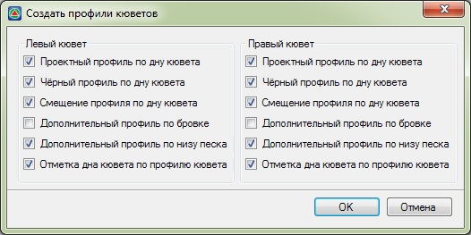
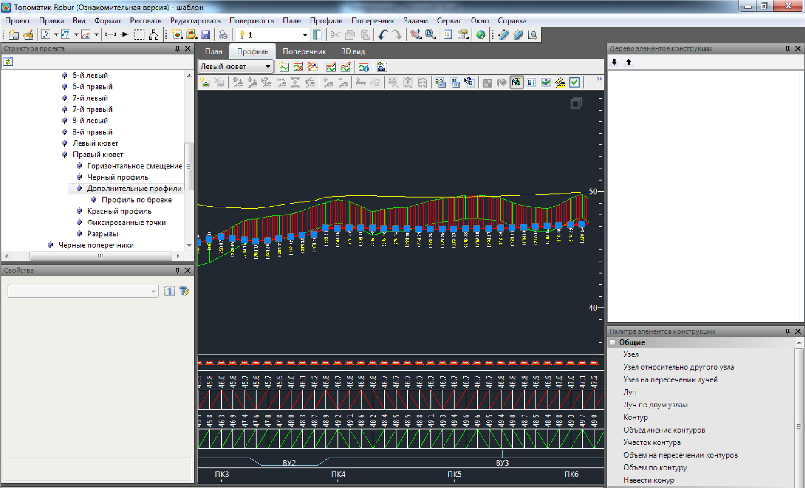
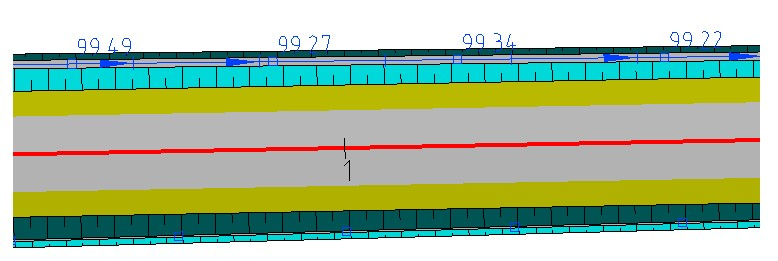

# Создание профиля кюветов

Данная функция позволяет создать продольный профиль по отметкам дна кюветов, которые были предварительно созданы на поперечниках.

Для этого:

1. Выберите элемент меню **Поперечник – Создать профили**. Откроется диалоговое окно:

   

   В данном окне с помощью соответствующих опций выберите какие элементы должны быть отображены на профиле кювета:

   **Проектный профиль по дну кювета** – проектная линия, изначально она строится по отметкам дна кюветов созданных на поперечниках.

   **Черный профиль по дну кювета** – линия черного профиля, которая строится по поверхности земли, по оси кювета.

   **Смещение профиля по дну кювета** – данная опция автоматически определяет горизонтальное смещение профиля относительно оси трассы на плане и записывает их в соответствующую таблицу структуры проекта.

   **Дополнительный профиль по бровке/ Дополнительный профиль по низу песка** - в качестве дополнительной информации может быть показана линия построенная по отметкам бровки проектного поперечника и линия выхода низа подстилающего слоя на откос.

   **Отметка дна кювета по профилю кювета** - включение данной опции отметки дна кювета будут привязаны к созданному продольному профилю. При изменении профиля кювета, отметки дна на поперечниках будут также динамически изменяться

2. Выберите необходимые параметры создания профиля кювета и нажмите **ОК**.

В результате программа создаст профиль по дну кювета и откроет его в окне **Профиль**:

Для редактирования линии проектного профиля кювета доступна большая часть тех же функций что и для основного профиля по оси дороги. Данный функционал был описан ранее в разделе [Проектирование продольного профиля](../../road_profile/general_provisions.md).

Если были созданы дополнительные линии профиля, то рабочие отметки расположенные рядом с проектной линией будут иметь несколько значений. Вне скобок подписывается глубина канавы, измеряемая по вертикали до линии черной земли, а в скобках глубина канавы от обочины или низа подстилающего слоя.



Примечание.

1. Если в настройках определения глубины кювета была установлена опция Привязать к профилю кювета, то последующее редактирования линии профиля будет приводить к автоматическому изменению отметок дна кюветов на соответствующих поперечниках.
2. Для настройки отображения соответствующим условным знаком линии профиля по водоотводу в окне План, воспользуйтесь меню План - Вертикальная планировка. (подробнее см. [Вертикальная планировка](../../road_profile/vertical_layout.md)):

   

