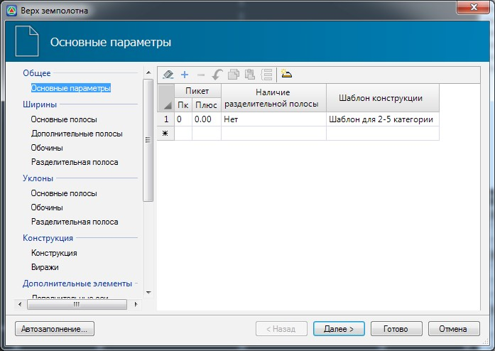
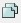
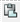
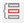
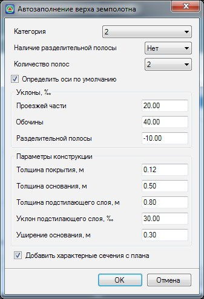
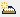
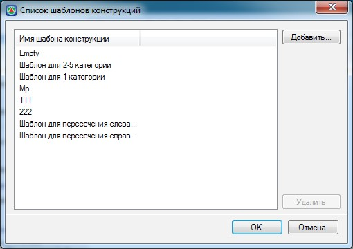

# Проектирование поперечников с использованием шаблонов конструкций

Большинство задач проектирования поперечных профилей может быть решено путем задания по участкам одного или более шаблонов конструкций и табличного ввода соответствующих параметров.

При начальной установке **Robur** библиотека содержит следующие шаблоны конструкций:

* для загородных дорог без разделительной полосы.
* для загородных дорог с разделительной полосой.
* для городских улиц.
* и т. д.



 Пользователь может сохранять часто используемые конструкции в библиотеку для их повторного использования.



Одна и та же конструкция, в процессе привязки на разные поперечники, рассчитывает свою геометрию, в зависимости от заданных параметров. Это позволяет назначить один шаблон конструкции на всю трассу или же на участок от одного пикета до другого, а геометрия на конкретном поперечнике будет определяться в процессе расчета, в зависимости от наличия отгона виражей, дополнительных полос, использования существующего покрытия и т. д.

Для того, чтобы назначить шаблон конструкции и задать необходимые параметры выберите элемент меню **Поперечник – Создать верх конструкции**, запуститься соответствующий мастер:

В левой части окна приведен перечень таблиц, которые заполняются и редактируются при помощи мастера, часть из этих таблиц может быть заполнена автоматически. При необходимости можно открыть необходимую таблицу, щелкнув по ее наименованию левой кнопкой мыши.

* Для удаления всех записей в таблице нажмите на кнопку: .
* Для создания новой строки нажмите на кнопку .
* Для удаления строки нажмите кнопку  .
* Для отмены произведенного действия нажмите кнопку.
* Для копирования содержимого строки нажмите кнопку .
* Для вставки копированной строки нажмите кнопку
* Для получения строки с значениями интерполированными по расстоянию между соседними .

Существует возможность автоматического заполнения таблиц конструкции параметрами из встроенной базы данных программы, в зависимости от категории дороги. Для этого необходимо в появившемся окне мастера нажать кнопку **Автозаполнение**. При этом откроется диалоговое окно:

В данном окне задаются основные параметры конструкции. После нажатия кнопки **ОК** произойдет автоматическое заполнение таблиц в соответствии с выбранными параметрами и категорией дороги.

**Категория** - выбирается из выпадающего списка и используется для определения основных параметров конструкции при автозаполнении.

**Наличие разделительной полосы** – выберите из выпадающего списка параметр **Да**. Если конструкция поперечного профиля содержит разделительную полосу и две отдельные проезжие части.

**Количество полос** - из выпадающего списка выбирается суммарное количество полос в обоих направлениях.

**Определить оси по умолчанию** - при включении данной опции, по заданным параметрам конструкции программа в соответствующей вкладке мастера **Верха конструкции** создаст список **Дополнительных осей** (правая\ левая бровки, правая\ левая кромки и т.д.), которые будут отображаться в окне **План**.



Подробное описание вкладки Дополнительные оси см. ниже.



**Уклоны** - значения поперечных уклонов полос проезжей части, обочин и разделительной полосы получаемые при автозаполнении.

**Параметры конструкции** - основные параметры конструктивных слоев дорожной одежды получаемые при автозаполнении.

**Добавить характерные сечения с плана** - если данная опция установлена, то при автозаполнении в таблицы будут заносится пикеты всех границ элементов трассы (НПК,КПК и т.п.).



Автозаполнение доступно на любом этапе работы мастера, но необходимо помнить, что все данные введённые в таблицу до применения процедуры автозаполнения будут потеряны, а вместо них будут занесены данные автозаполнения. Поэтому рекомендуется использовать автозаполнение на первом шаге мастера.



Кнопка **Далее** в нижней части мастера осуществляет переход на его следующую таблицу, а кнопка **Назад** на предыдущую. Кнопка **Отмена** закрывает мастер, при этом все данные, занесенные в таблицы теряются. Кнопка **Готово** закрывает мастер с применением всех заданных параметров.

Рассмотрим заполнение основных таблиц параметров конструкции.

Основные параметры:

В данной таблице можно задать несколько участков с разными шаблонами конструкции поперечника. Для её заполнения необходимо указать:

**Пикет Плюс** - задается участок, на котором применяется данный шаблон. Начало участка соответствует заданному пикету, а конец – началу следующего участка. Конец последнего участка соответствует концу трассы. Если на протяжении всей трассы используется только один шаблон, то эта таблица должна содержать только одну строку, в графе **Пикет** должен быть указан пикет начала трассы. Это правило распространяется на все таблицы конструкций.

**Наличие разделительной полосы** – при установлении в данном поле параметра **Нет**, значения ширин и уклонов заданных в соответствующих таблицах будут игнорироваться.

**Шаблон конструкции** - из выпадающего списка может быть выбран один из стандартных шаблонов. По умолчанию включены следующие шаблоны:

1. **Empty** - пустой шаблон.
2. **Шаблон для 2-5 категории** - используется для проектирования дорог 2-5 категории.
3. **Шаблон для 1 категории** - используется для проектирования дорог 1 категории.
4. **Мр** - шаблон содержащий в себе только линию верха конструкции и используется для решения задач фрезерования\ выравнивания покрытия.
5. **111 и 222** - шаблоны содержащие в себе только линию верха конструкции и используется для решения задач по проектированию поверхностного водоотвода в городских условиях и решения задач фрезерования\ выравнивания покрытия.
6. **Шаблон для пересечения слева\ справа** - используется на подобъектах, создаваемых по кромкам закруглений на четвертях одноуровневых пересечений.

При необходимости применения собственного шаблона конструкции:

1. Нажмите пиктограмму **Таблица конструкций**  , расположенную в верхней части окна. Откроется окно со списком конструкций которые привязаны к текущей трассе:

   

2. Для включения нового шаблона в список нажмите кнопку **Добавить**.
3. Откройте в проводнике **Windows** папку, в которой находится требуемый файл конструкции поперечного профиля и щелкните дважды по нему левой кнопкой мыши. Название выбранного шаблона отобразится в окне **Список шаблонов конструкций**. Нажмите **Ок**.

В результате, добавленный шаблон отобразится в выпадающем списке поля **Шаблон конструкции** и станет доступен для выбора.

Нажмите кнопку **Далее** для перехода на следующую таблицу мастера.