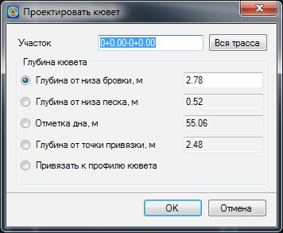

# Проектирование кюветов

Положение кювета определяется точкой привязки и отметкой дна.

Разность между отметкой точки привязки и отметкой дна называется глубиной кювета от точки привязки. Разность между отметкой бровки проектного поперечника и отметкой дна кювета называется глубиной кювета от бровки. Разность между отметкой выхода подстилающего слоя на откос и отметкой дна кювета называется глубиной кювета от низа песка.

Проектирование кюветов, как правило, производят в такой последовательности:

1. Проектируют откосы в насыпи и выемке с произвольным значением глубины кювета. На этом этом этапе назначаются такие параметры кювета как ширина дна, заложение его откосов и т.п. Данные элементы были описаны ранее в разделе **Назначение параметров откосов**.
2. Назначают глубину кюветов от бровки или от низа подстилающего слоя, исходя из эксплуатационных условий.
3. Создают продольный профиль кювета.
4. Редактируют профиль кювета таким образом, чтобы обеспечить отвод воды.

Для назначения глубины кюветов, выберите элемент меню **Поперечник - Левый кювет(Правый кювет)**.

Откроется диалоговое окно:

**Участок** – в данном поле задается участок, на котором будут проектироваться кюветы. По умолчанию, при открытии окна, программа предлагает задать глубину кюветов на текущем поперечном профиле.

**Глубина кювета** - может задаваться одним из следующих способов:

* Глубиной от бровки.
* Глубиной от низа подстилающего слоя.
* Отметкой дна.
* Глубиной от точки привязки, которая находится на пересечении проектного откоса с линией земли.
* Привязкой к продольному профилю кювета. В этом случае, на заданном участке отметки дна кювета будут привязаны к заранее запроектированному продольному профилю. При изменении профиля кювета, отметки дна на поперечниках будут также динамически изменяться. Процедура создания и редактирования продольного профиля кюветов будет описана далее.

Выберите необходимый способ назначения глубины кюветов и задайте ее требуемое значение.

Нажмите **ОК**.

В результате на соответствующих поперечниках будут добавлены кюветы с заданной глубиной.