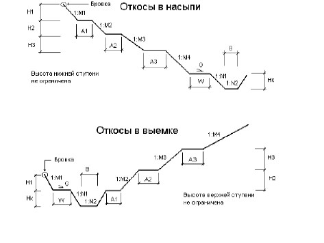
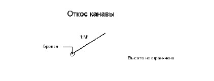

# Проектирование откосов

Откосы являются стандартными элементами конструкции поперечного профиля. Откосы в насыпи и в выемке могут иметь до четырех ступеней. Каждая ступень задается коэффициентом заложения откоса, высотой ступени, длиной и уклоном полки.

Имеется три типа откосов:

* откосы в насыпи.
* откосы в выемке.
* откосы канавы (выемки без кюветов).

Конфигурация откосов определяется параметрами, которые могут быть заданы как для каждого конкретного поперечника раздельно для левой и правой стороны, так и для группы поперечников на выбранном участке.

На рисунках приведены схемы для всех типов откосов с указанием их параметров:

* **M1, M2, M3, M4** – коэффициенты заложения откосов насыпи и выемки.
* **H1, H2, H3** – высоты ступеней.
* **A1, A2, A3** – длины полок.
* **N1, N2** – коэффициенты заложения откосов кювета.
* **Hk** – глубина кювета.
* **B** – ширина дна кювета.
* **W** – ширина прикюветной полки.
* **G** – уклон прикюветной полки.
* **Gп** - уклон основных полок откоса.
* **Gk** - поперечный уклон дна кювета.



 Для насыпи высота нижней ступени не ограничена, для выемки высота верхней ступени не ограничена, для канавы высота не ограничена.



Привязка откосов происходит в следующей последовательности:

Определяются отметка и смещение бровки проектного поперечника. В случае насыпи, к бровке последовательно пристыковываются сегменты стандартного типа до встречи с землей, а затем привязывается кювет. В случае выемки, сначала привязывается часть проектных откосов, перед кюветом, потом сам кювет, а затем пристыковывается оставшаяся часть откосов после кювета до встречи с землей.