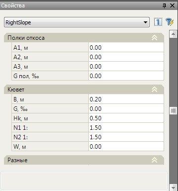
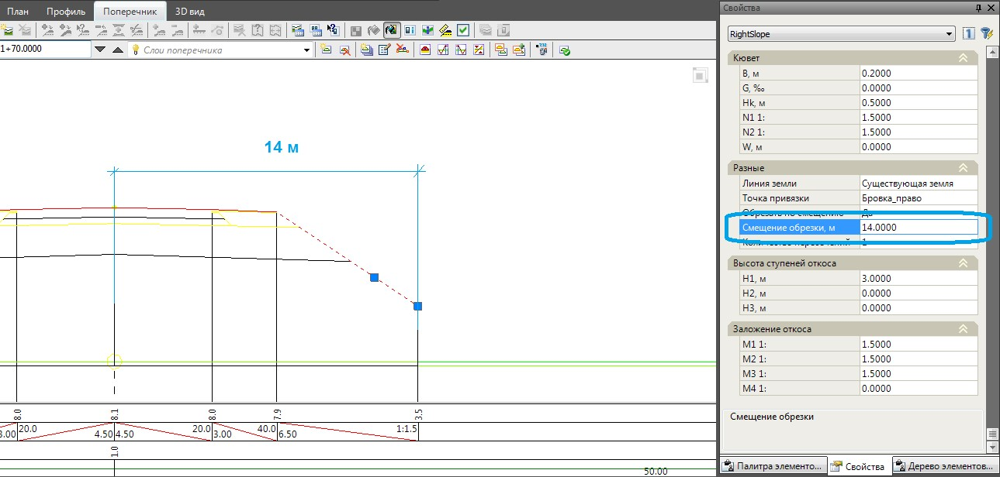

# Редактирование параметров откоса через окно Свойства

Параметры предварительно созданных откосов могут быть изменены как через окно **Настройка откоса**, так и через стандартное окно свойств выбранного объекта. Для этого, на поперечнике левой кнопкой мыши выберите откос, который необходимо модифицировать. Его основные параметры отобразятся в окне **Свойства**:

Основные параметры откоса такие как: полки откоса, кюветы, заложения и высоты ступеней были описаны выше в разделе **Редактирование параметров откосов**.

В группе **Разное** представлены дополнительные специфические параметры откосов используемые, как правило, при проектировании в стесненных условиях: **Линия земли** – по умолчанию проектный откос строится до линии черной земли. Однако, имеется возможность визуального задания контура по которому его необходимо обрезать. Для этого в соответствующем поле нажмите кнопку , курсор примет форму прицела. Левой кнопкой мыши укажите контур в графическом поле окна **Поперечник**, до которого необходимо строить проектный откос.

**Количество пересечений** – задайте в данном поле необходимое значение, если необходимо чтобы проектный откос несколько раз пересекал контур, до которого строится.

**Обрезать по смещению** – по умолчанию откос строится до пересечения с землей и в данном поле установлен параметр **Нет**. Если же необходимо обрезать откос на заданном расстоянии от оси установите параметр **Да**, а затем задайте необходимое расстояние в поле **Смещение обрезки,м**. Для левой стороны смещение задается с отрицательным знаком.

