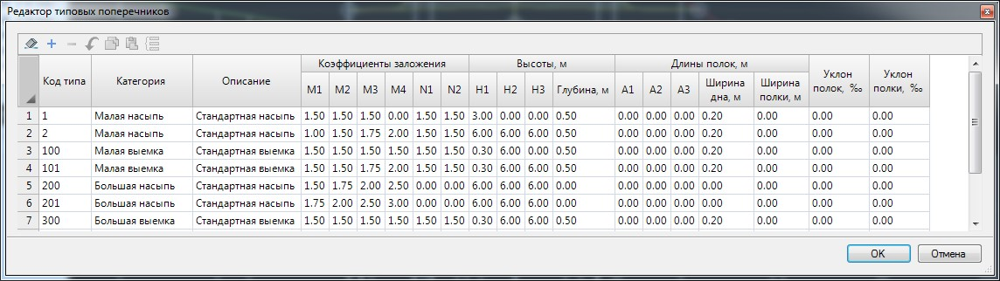

# Редактирование библиотеки типовых откосов

Библиотека откосов представляет собой таблицу, каждая строка которой описывает один набор типовых параметров. Каждый типовой набор должен иметь уникальный номер в диапазоне от 1 до 9999, в дальнейшем для краткости называемый номером типа. Для удобства использования, типовые наборы разбиты на пять категорий: малая насыпь; большая насыпь; малая выемка; большая выемка; канава.

Для редактирования библиотеки откосов выберите элемент меню **Поперечник – Типовые поперечники**. Откроется таблица параметров, в которую можно занести новые типовые наборы:

Для создания нового типового откоса, на основе существующего достаточно скопировать соответствующую строку таблицы и внести в нее необходимые изменения. Воспользуйтесь для этого кнопками **Копировать, Вставить** расположенных в верхней части окна.

Для выхода из таблицы типовых откосов с сохранением внесенных изменений нажмите **ОК**.