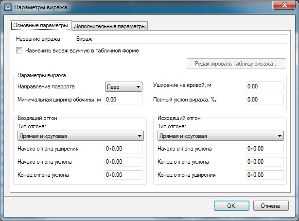
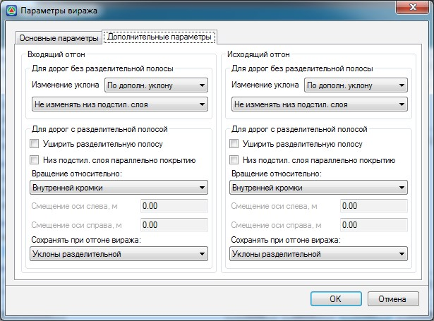
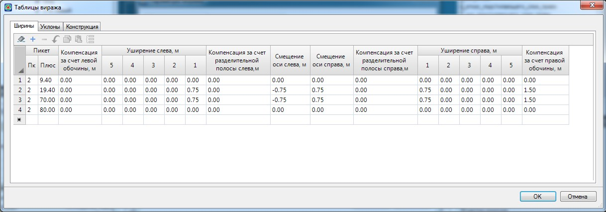
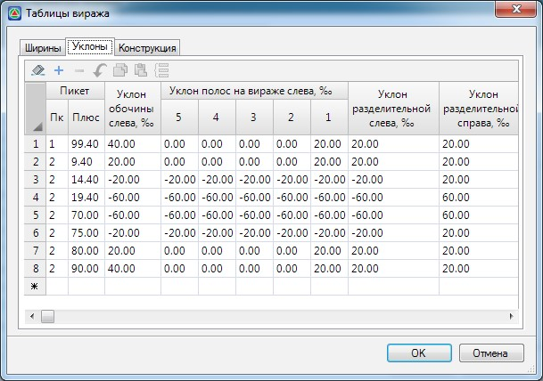
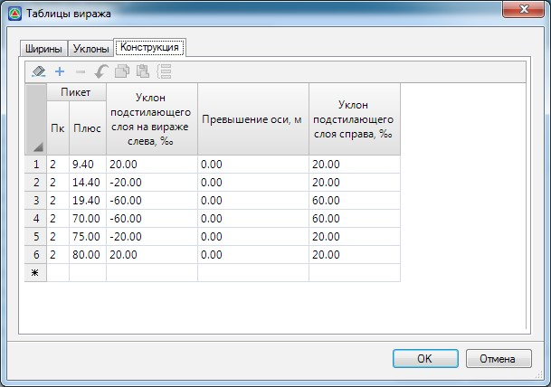

# Общий случай создания виража

Для того чтобы самостоятельно создать вираж на заданном участке.

1. Нажмите кнопку **Добавить** в окне **Виражи**. Откроется окно **Параметры виража**:

   

На вкладке **Основные параметры**:

В поле **Наименование виража** задается его имя, это поле является информационным и необязательным для заполнения.

В группе параметров **Параметры виража** задается:

* **Направление поворота** - из выпадающего списка выбирается направление поворота виража (лево или право).
* **Минимальная ширина обочины** - задается минимально допустимое значение ширины обочины при выполнении отгона виражей.
* **Уширение на кривой** - задается значение максимального уширения проезжей части в кривой.
* **Полный уклон виража** - задается максимальное значение уклона виража между отгонами.

В выпадающем списке **Тип отгона** укажите тип входящего и исходящего отгона, который необходимо применить в создаваемом вираже. Возможны следующие типы отгонов:

* **Прямая и круговая** - отгон виража в пределах переходной кривой, при сопряжении прямой и круговой кривой.
* **2 круг. в одну сторону (прямая < 100 м)** - отгон виража при сопряжении двух круговых кривых, направленных в одну сторону без прямой вставки между ними или с прямой вставкой менее 100 метров (см поясняющий рисунок выше, в разделе **Автовираж**).
* **2 круг. в раз. стор. (прям. < 40 м)** - отгон виража при сопряжении двух кривых, направленных в разные стороны без прямой вставки между ними или с прямой вставкой менее 40 метров ( см поясняющий рисунок выше, в разделе **Автовираж** ).
* **2 круг. в раз. стор. (40 м < прям. < 60 м)** отгон виража при сопряжении двух кривых, направленных в разные стороны с прямой вставкой меньше 60 метров, но больше 40 метров (см поясняющий рисунок выше, в разделе Автовираж).

В группе полей **Входящий отгон задается**:

* **Начало отгона уширения** - пикет плюс начала входящего отгона уширения проезжей части.
* **Начало отгона уклона** - пикет плюс начала входящего отгона уклона проезжей части.
* **Конец отгона уклона** - задается пикет окончания входящего отгона уклона проезжей части.

В группе полей **Исходящий отгон задается**:

* **Начало отгона уклона** - пикет плюс начала исходящего уклона проезжей части.
* **Конец отгона уклона** - пикет плюс конца исходящего уклона проезжей части.
* **Конец отгона уширения** - пикет конца исходящего отгона уширения проезжей части.

Пикетажные участки отгонов могут быть заданы визуально в окне **План** с привязкой к подобъекту, для этого напротив необходимого параметра нажмите кнопку 
.

Остальные свойства текущего виража, такие как схема отгона, оси вращения, правила вращения низа подстилающего слоя и т.п. задаются на вкладке **Дополнительные параметры**: 

Данные параметры были описаны выше в разделе [Автовираж](avtovirazh.md).

В случае когда ни одна из стандартных типовых схем отгона виража не подходит, имеется возможность самостоятельного попикетного задания параметров виража в табличном виде. Для этого вернитесь на вкладку **Основные параметры** и установите опцию **Назначить вираж вручную в табличной форме**, после чего станет активной кнопка **Редактировать таблицу виража**, нажмите ее. Откроется таблица с подробными параметрами виража.

На вкладке **Ширины** задаются поправочные значения к ширинам основных полос:

**Уширение слева, м** - значение уширений, добавляемое к основным полосам с соответствующими номерами.

**Смещение оси слева/справа, м** - смещение осевой полосы разметки относительно разбивочной оси, в случае если уширение устраивается с внутренней стороны обочины.

**Компенсация за счет разделительной полосы слева/справа, м** - значение ширины части разделительной полосы, в пределах которой будет устраиваться уширение проезжей части.

**Компенсация за левой/правой обочины, м** - значение ширины обочины, в пределах которой будет устраиваться уширение проезжей части. Оставшаяся часть необходимого уширения проезжей части будет осуществляться за счет общего уширения земляного полотна.

На вкладке **Уклоны** задаются уклоны полос проезжей части, разделительной полосы и обочины на вираже:

На вкладке **Конструкция** задается **Уклон подстилающего слоя на вираже** и превышение оси.

Задайте необходимые параметры виража и нажмите **ОК**.

В результате на заданных пикетах будет создан вираж с соответствующими параметрами.