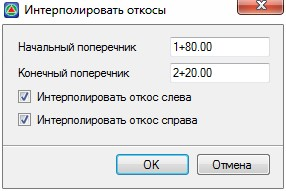

# Интерполировать откосы

Функция позволяет между заданным начальным и конечным поперечником, автоматически запроектировать откосы методом интерполяции параметров.

Для интерполирования откосов на участке:

1. Выберите меню **Поперечник – Интерполировать откосы**, откроется диалоговое окно:

   

   В полях **Начальный** и **Конечный** поперечники задайте пикеты, между которыми необходимо интерполировать откосы.

   С помощью опций **Интерполировать откос слева\справа** имеется возможность задать сторонность интерполяции. Т.е. заложение откосов будет интерполироваться с обоих сторон дороги или только с одной.

2. Задайте необходимые параметры и нажмите **ОК**. В результате программа автоматически запроектирует откосы между начальным и конечным поперечниками, интерполируя параметры откосов.

Ниже условно приведена схема работы данной функции:

