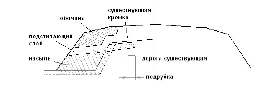
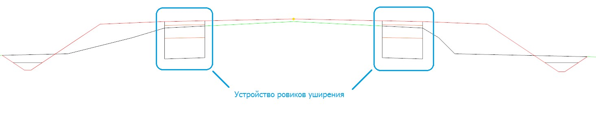
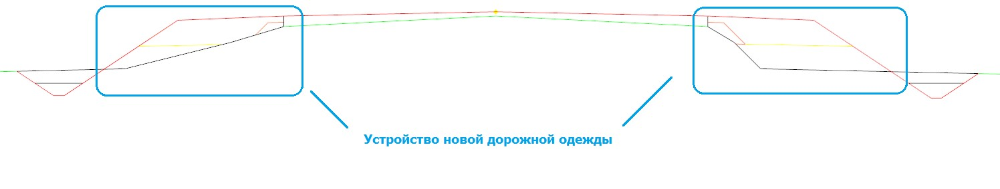
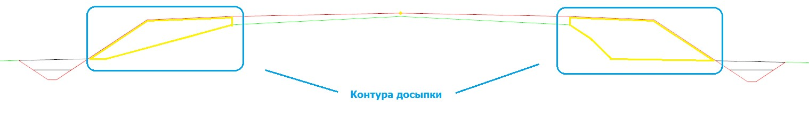
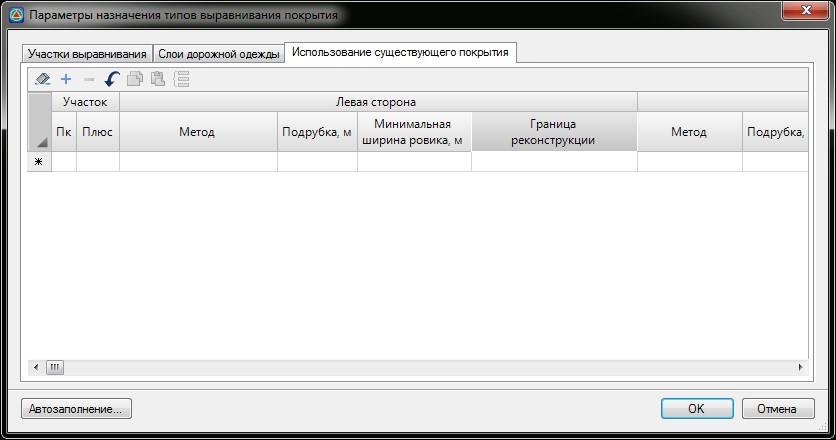
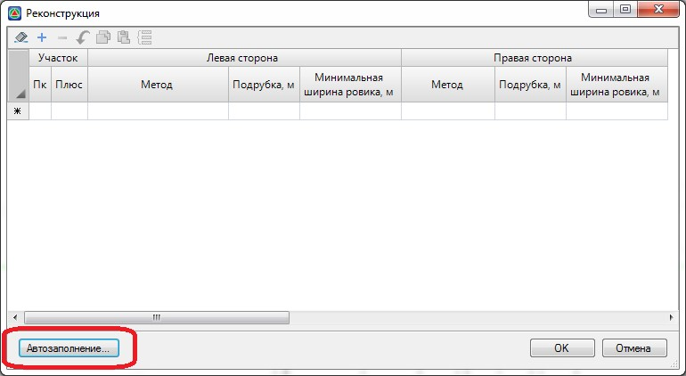
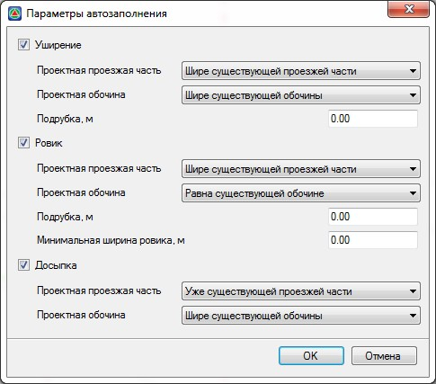
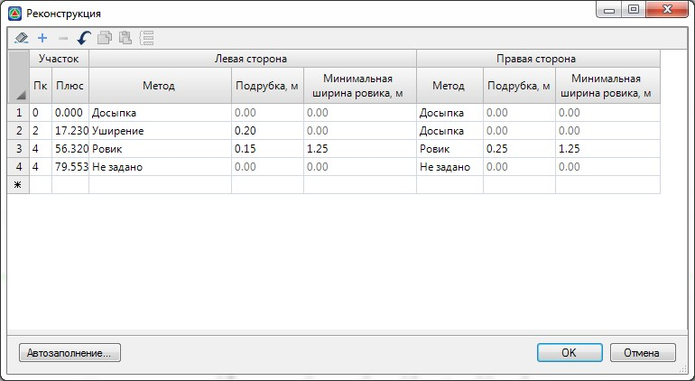

# Реконструкция

Данный блок функций позволяет осуществлять модификацию проектируемой дорожной одежды с учетом существующего поперечного профиля и его конструктивных слоев. В дальнейшем эту процедуру будем называть использованием существующего покрытия.

Предусмотрено четыре основных способа использования существующего покрытия: уширение, досыпка, досыпка одним слоем и ровик:

* **Уширение** - это способ реконструкции, при котором существующее дорожное покрытие может использоваться при устройстве новой дорожной одежды, c учетом необходимой величины подрубки кромок проезжей части. В данном случае происходит срезка существующей обочины для устройства необходимого уширения проезжей части:

  

  Данная поправка позволяет модифицировать конструктивные слои проектируемой дороги, что учитывается в дальнейшем при подсчете объемов работ. В пределах существующего покрытия, с учетом его подрубки, должны быть заданы необходимые параметры усиления, выравнивания или фрезерования - для этого предусмотрен отдельный блок задач по ремонту покрытия. Функционал по ремонту покрытия будет рассмотрен далее в соответствующем разделе.

* **Ровик**- данный способ реконструкции схож уширением, т.к. в данном случае также в пределах существующего покрытия осуществляется его ремонт (фрезерование, выравнивание,усиление), а полная конструкция устраивается только на участках уширений. Однако, в данном случае срезка обочины и устройство новых конструктивных слоев происходит не до проектного откоса, как при уширении, а только до проектной кромки, т.е. до границы уширения.

  

* **Досыпка** – это способ реконструкции, при котором существующее дорожное покрытие и земляное полотно не подвергается никаким существенным изменениям. Непосредственно поверх них, до существующего покрытия, осуществляется устройство новой дорожной конструкции c досыпкой грунта на обочины и откосы:

  

   В пределах существующего покрытия осуществляются работы по его фрезерованию, выравниванию и усилению. Порядок задания данных параметров будет описан далее в соответствующем разделе.

* **Досыпка одним слоем** – частный случай досыпки. В данном случае вся присыпная часть устраивается исключительно из одного грунта, без устройства конструктивных слоев, таких как основание и подстилающий слой, которые могут быть при стандартной досыпке:

  



Для работы вышеописанных стандартных схем использования существующего покрытия необходимо чтобы на черных поперечниках были прокодированы характерные точки: 5-ось существующая, 4-кромка. Функкционал по созданию и редактированию существующих поперечных профилей был описан ранее. См. раздел [Создание и редактирование черных поперечников](../../../rb_survey/alg/track_crossection/createing_and_editing_black_diameters.md).



Для выбора способа использования существующего покрытия выберите элемент меню **Поперечник – Поправки - Реконструкция**. Откроется диалоговое окно:

**Участок** – задается пикетажное значение характерного участка. Каждая строка данной таблицы определяет протяженность участка с определенным видом работ.

**Метод** – в данном поле из выпадающего списка выбирается один из выше описанных способов использования существующего покрытия. Метод использования существующего покрытия для каждой из сторон участка может быть различен. К примеру с левой стороны устраивается конструкция уширения, а с правой стороны производится досыпка грунтом.

Если на определенном участке нет необходимости в использовании существующего покрытия, то в соответствующем поле выберите признак **Не использовать**. В этом случае проектная дорожная одежда будет строиться без учета особенностей существующего поперечного профиля, который будет засыпаться или срываться по всей его ширине (новое строительство).

**Подрубка** – задается расстояние, на которое должна быть подрублена существующая конструкция дорожной одежды с каждой стороны. Эта поправка будет учитываться при дальнейшем конструировании и подсчете объемов работ. Т.к. площадь существующего покрытия будет меньше на величину подрубки, а площадь уширяемой части соответственно больше.

Данная поправка становится доступна для задания при выборе метода **Уширения** или **Ровик**. При других способах использования существующего покрытия она не учитывается.

**Граница реконструкции**. В данном выпадающем списке в качестве границы расчета объемов по реконструкции\выравниванию могут быть выбраны либо **Существующие**, либо **Проектные кромки**.



Примечание. Проектные кромки в качестве границы реконструкции могут использоваться в случае, когда уширение проектного покрытия относительно существующего составляет незначительную величину (например, 1 - 7 см.). Применяется, преимущественно с типом использования существующего покрытия – Досыпка или Досыпка одним слоем.



Технологически, основные задачи по конструированию поперечных профилей автомобильной дороги при реконструкции выполняются аналогично как и для нового строительства. Т.е. вначале задаются основные параметры конструкции и дорожной одежды, затем проектируются откосы и кюветы, и уже после выбирается способ использования существующего покрытия.

Метод использования существующего покрытия может быть определен автоматически.

Для этого:

1. В окне **Реконструкция** нажмите кнопку **Автозаполнение**:

   

   Откроется окно **Параметры Автозаполнения**:

   

   Установите опции напротив тех способов, которые необходимо будет использовать при реконструкции. Если какой-либо способ реконструкции не отмечен, то он не будет использоваться при автозаполнении, а его параметры в данном окне будут заблокированы.

   Критерии для назначения каждого способа реконструкции выбираются из выпадающего списка. К примеру, по умолчанию, на участках где проезжая часть шире существующей и проектная бровка также выходит за существующую, будет устраиваться уширение с полной срезкой обочины. Если же проектная проезжая часть шире существующей, но проектная и существующая бровки совпадают, дорожная конструкция на уширении будет устраиваться в ровике.

   

   1. Если на каком-то участке (поперечнике) не соблюдается не один критерий, то при автозаполнении ему по умолчанию будет назначен метод Не задано.
   2. Если настройки автозаполнения были заданы не корректно и на каком-то участке (поперечнике) по условиям могут подходить несколько критериев, то на данном участке при автозаполнении метод реконструкции будет выбран произвольным образом.

   

2. Задайте необходимые критерии для автоматического определения методов реконструкции и нажмите **Ок**.

   

В результате, программа проанализирует каждый поперечник и определит для него соответствующий способ реконструкции (уширение, ровик, досыпки), заполнив исходную таблицу. При необходимости, в дальнейшем, результаты автозаполнения могут быть откорректированы пользователем.