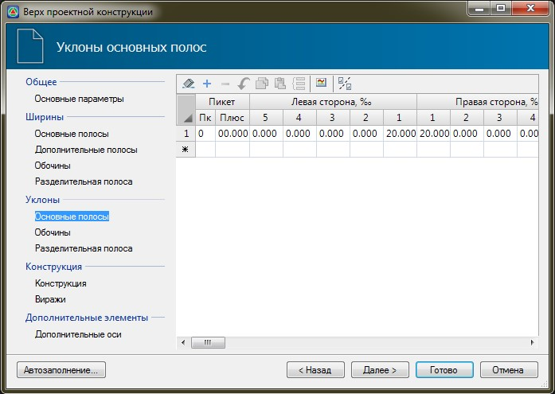

# Уклоны основных полос

 

В данной таблице задаются уклоны основных полос проезжей части слева и справа, и участок, в пределах которого действуют эти значения уклонов. При различных значениях уклонов на начальном и конечном участке, на промежуточных пикетах они будут рассчитываться линейной интерполяцией.



 Рекомендуется в данной таблице задавать уклоны именно основной проезжей части, без учета виражей, т.к. эти элементы задаются в других вкладках мастера.



Уклоны основных полос проезжей части, обочины или разделительной полосы могут быть рассчитаны по разности высот между двумя выбранными продольными профилями. Для того чтобы определить уклон основной полосы по профилям нажмите пиктограмму **Назначить уклоны по профилям**  , расположенную в верхней части окна. Данная функция была описана выше, в разделе [Ширины основных полос](width_main_stripes.md).